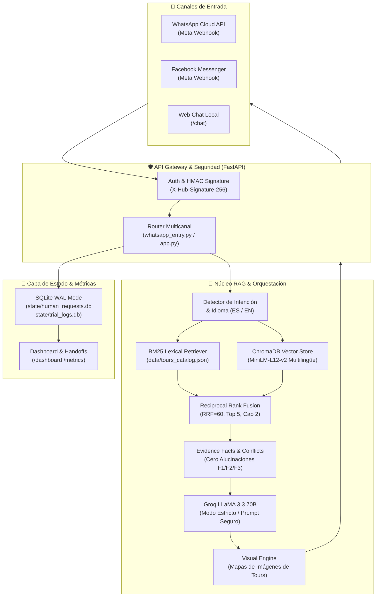

# Texeira Travel Tour — Intelligent Tourism Chatbot & RAG System

[](https://www.python.org/)
[](https://fastapi.tiangolo.com/)
[](https://www.trychroma.com/)
[](https://cloud.google.com/run)
[](https://groq.com/)
[](#)

Sistema conversacional inteligente multicanal (WhatsApp Business Cloud API, Facebook Messenger y Web Chat) para la agencia de viajes y turismo **Texeira Travel Tour** (Cusco, Perú). Diseñado con arquitectura **RAG Híbrido** (BM25 léxico + embeddings densos multilingües con *Reciprocal Rank Fusion* RRF=60), validación estricta contra catálogo canónico (F1/F2/F3), derivación inteligente a asesores humanos y panel de métricas operativas en tiempo real.

---

## 🏛️ Arquitectura del Sistema



---

## 📁 Estructura del Repositorio

El proyecto sigue una estructura limpia, modular y desacoplada acorde a las mejores prácticas de ingeniería de software:

```text
Chat bot/
├── .editorconfig                  # Estandarización de estilo, codificación UTF-8 e indentación
├── .gitattributes                 # Normalización de saltos de línea y formatos binarios
├── .gitignore                     # Protección rigurosa de secretos, logs y bases de datos locales
├── .env.example                   # Plantilla documentada de variables de entorno requeridas
├── AGENTS.md                      # Reglas permanentes y protocolo obligatorio de 4 pasos
├── README.md                      # Documentación maestra del proyecto
├── actualizar_nube.bat            # Script de despliegue a Google Cloud Run (Costo $0.00)
│
├── texeira-prueba-v4-evidencias/  # [CANÓNICO] Código fuente activo de producción
│   ├── app.py                     # Servidor FastAPI principal y endpoints RAG
│   ├── whatsapp_entry.py          # Entrypoint unificado para Webhooks de Meta y Cloud Run
│   ├── runtime_settings.py        # Configuración dinámica y aislamiento de directorios de estado
│   ├── auth_middleware.py         # Middleware de autenticación y validación de seguridad
│   ├── handoff_support.py         # Gestión de tickets y escalamiento a atención humana
│   ├── trial_support.py           # Detección de entidades, mapeo de tours y catálogo
│   ├── operational_metrics.py     # Cálculo de tasas de resolución autónoma y latencias
│   ├── verified_routes.py         # Validación canónica de circuitos y atractivos turísticos
│   ├── Dockerfile                 # Imagen Docker optimizada con embeddings offline en caché
│   ├── docker-compose.yml         # Orquestación local para desarrollo en contenedores
│   ├── requirements.txt           # Dependencias de Python con versiones fijadas
│   │
│   ├── src/                       # Módulos desacoplados del sistema
│   │   ├── services/              # Clientes de mensajería (WhatsApp, Messenger)
│   │   ├── visual/                # Motor visual y resolución de imágenes de tours
│   │   ├── retriever.py           # Buscador híbrido BM25 + ChromaDB con fusión RRF
│   │   ├── evidence.py            # Validador de hechos, políticas y resolución de conflictos
│   │   ├── agent.py               # Orquestador del agente conversacional
│   │   └── preprocessing.py       # Normalización y tokenización de consultas turísticas
│   │
│   ├── data/                      # Fuentes canónicas oficiales de la agencia (F1, F2, F3)
│   ├── chroma_f1_..._db/          # Base de datos vectorial indexada activa
│   ├── state/                     # Almacenamiento persistente local (SQLite, PRAGMA WAL)
│   ├── tests/                     # Suite de pruebas automatizadas y benchmarks de tesis
│   └── docs/                      # Evaluaciones formales, rúbricas e informes JSON
│
├── docs/                          # Documentación ejecutiva, bitácoras y auditorías históricas
├── scripts/                       # Scripts utilitarios de mantenimiento y configuración
├── versiones_anteriores/          # Respaldos de versiones previas protegidas
└── logs/                          # Logs de depuración aislados fuera del código fuente
```

---

## 🔄 Protocolo de Buenas Prácticas (Ciclo Obligatorio de 4 Pasos)

Conforme a lo establecido en [AGENTS.md](file:///c:/Users/HP/Desktop/Chat%20bot/AGENTS.md), cualquier cambio en el sistema debe cumplir estrictamente el siguiente ciclo:

1. **Desarrollo y Prueba Local**:
   - Todo trabajo se realiza exclusivamente en `texeira-prueba-v4-evidencias/`.
   - Ejecutar la suite de pruebas local (`python tests/test_audit_retrieval.py`).
   - *Regla*: Nunca desplegar código con errores o sin probar.

2. **Despliegue a Google Cloud Run**:
   - Ejecutar `actualizar_nube.bat`.
   - Mantener siempre la política de **Costo $0.00** (`--min-instances 0`, auto-escala a cero tras inactividad).

3. **Verificación en Vivo (WhatsApp / API)**:
   - Validar que el webhook responda `200 OK` a las peticiones de Meta.
   - Probar flujos interactivos de WhatsApp y verificar que no se envíen fotos o teléfonos innecesarios.

4. **Sello y Push en Git (`git push`)**:
   - Una vez comprobada la estabilidad en la nube, registrar los cambios con commits semánticos (`feat:`, `fix:`, `refactor:`, `docs:`).
   - Sincronizar con `git push origin main`.

---

## 🚀 Puesta en Marcha en Local

### 1. Requisitos Previos
- Python 3.11 instalado.
- Cuenta de Google Cloud SDK (para despliegue a Cloud Run).
- Credenciales de proveedor LLM (Groq, OpenAI, etc.).

### 2. Configuración de Entorno
Copia la plantilla y configura tus variables:
```bash
cp .env.example .env
```

### 3. Instalación de Dependencias
```bash
cd texeira-prueba-v4-evidencias
pip install -r requirements.txt
```

### 4. Inicio de Servicios Locales
En PowerShell:
```powershell
# Chat Web y Servidor RAG Local (Puerto 8021)
.\INICIAR.ps1

# Webhook WhatsApp Local para Túneles ngrok (Puerto 8022)
.\INICIAR_WHATSAPP.ps1

# Bandeja de Asesores Humanos y Métricas (Puerto 8023)
.\INICIAR_ASESORES.ps1
```

Acceso en el navegador:
- **Chat de Pruebas:** [http://127.0.0.1:8021/chat](http://127.0.0.1:8021/chat)
- **Panel de Tickets de Asesores:** [http://127.0.0.1:8023/handoffs](http://127.0.0.1:8023/handoffs)
- **Dashboard de Métricas Operativas:** [http://127.0.0.1:8023/dashboard](http://127.0.0.1:8023/dashboard)

---

## 🧪 Pruebas Automatizadas y Benchmarks de Tesis

Para validar el sistema localmente sin consumir tokens de API ni incurrir en costos:

```bash
cd texeira-prueba-v4-evidencias

# 1. Auditoría de recuperación híbrida sin LLM (RRF60 / top 5 / cap 2):
python tests/test_audit_retrieval.py

# 2. Benchmark Académico Formal de la Tesis (30 casos independientes ES/EN):
python tests/evaluate_academic_benchmark.py

# 3. Consistencia multilingüe y detección de idioma (16 casos):
python tests/evaluate_language_local.py

# 4. Regresión de integridad, hechos y métricas (21 casos):
python tests/test_audit_20260912.py

# 5. Pruebas de cola persistente de atención humana (Handoff):
python tests/test_handoff.py
```

---

## ☁️ Despliegue en Google Cloud Run (Producción)

El sistema está desplegado en la nube de Google mediante infraestructura serverless:

- **Servicio:** `texeira-whatsapp`
- **Región:** `us-central1`
- **Estrategia de Costo:** **$0.00 / mes** gracias a `--min-instances 0` (el contenedor escala a cero cuando no recibe mensajes de turistas y se despierta en milisegundos con `--cpu-boost`).
- **Seguridad:** Los secretos y tokens de acceso se administran mediante Google Secret Manager y variables de entorno protegidas.

Para compilar y desplegar una nueva versión en producción, simplemente ejecuta:
```cmd
actualizar_nube.bat
```

---

## 📡 Catálogo de Endpoints de la API

| Método | Endpoint | Autenticación | Descripción |
|---|---|:---:|---|
| `GET` / `POST` | `/webhook` | HMAC SHA256 / Verify Token | Webhook oficial de Meta para WhatsApp Business y Messenger. |
| `POST` | `/chat` | Pública / Sesión | Endpoint JSON para interactuar con el agente RAG. |
| `GET` | `/healthz` | Pública | Endpoint de monitoreo de salud para Kubernetes y Cloud Run. |
| `GET` | `/handoffs` | HTTP Basic (`ADMIN_USER`) | Panel administrativo de derivaciones a asesores humanos. |
| `GET` | `/dashboard` | HTTP Basic (`ADMIN_USER`) | Dashboard visual de métricas de investigación (resolución autónoma, latencias). |
| `GET` | `/metrics` | HTTP Basic (`ADMIN_USER`) | Métricas operativas cuantitativas en formato JSON. |

---

## 📄 Licencia y Derechos

Desarrollado para **Texeira Travel Tour** como parte del proyecto de investigación y tesis de ingeniería de sistemas. Todos los derechos reservados.
