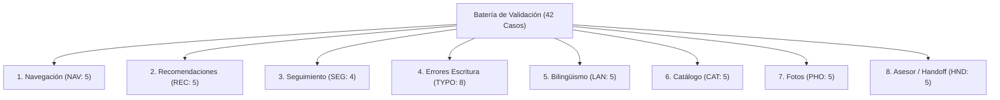

# Plan de Validación Técnica y Funcional — Revisión Desplegada en WhatsApp

**Proyecto:** Automatización del Servicio al Cliente en Texeira Travel Tour mediante Agente Conversacional RAG
**Fecha:** 8 de octubre de 2026; objetivo actualizado el 9 de octubre
**Revisión objetivo en Cloud Run:** `texeira-whatsapp-00048-mvd`
**Estado de esta evaluación:** Preparación; 0/42 casos ejecutados en el registro.
**URL de Producción:** `https://texeira-whatsapp-a5uzavilla-uc.a.run.app`
**Base de Código Desplegada:** Correcciones `6fd6131`, integradas en `61cafec`; ver [VERIFICACION_DESPLIEGUE_RECOMENDACIONES_20261009.md](VERIFICACION_DESPLIEGUE_RECOMENDACIONES_20261009.md).
**Rama de actualización documental:** `feature/record-recommendation-deployment-20261009` (conforme a AGENTS.md). El plan y el registro conservan su nombre para continuidad; los 42 casos siguen pendientes.

La referencia de partida del 08/10 fue `00047-khb`. El 09/10 se desplegaron las correcciones locales de recomendaciones y se comprobó `00048-mvd` con 100 % del tráfico, salud HTTP 200 y seguridad de paneles. El informe enlazado documenta su alcance. Antes de ejecutar el piloto, confirmar nuevamente la revisión activa; estas comprobaciones no sustituyen la ejecución de la matriz.

---

## 1. Referencia de partida observada el 08/10/2026

| Parámetro | Valor Verificado en Nube | Observación Técnica |
| :--- | :--- | :--- |
| **Servicio Cloud Run** | `texeira-whatsapp` | Gestionado en Google Cloud Run, región `us-central1` |
| **Proyecto GCP** | `texeira-whatsapp-bot` | Entorno de producción del bot de WhatsApp |
| **Revisión Activa** | `texeira-whatsapp-00047-khb` | `latestCreatedRevisionName = latestReadyRevisionName` |
| **Distribución de Tráfico** | **100%** a `00047-khb` | Tráfico completo enrutado a la revisión vigente |
| **Salud de Servicio (`/health`)** | **HTTP 200** `{"status":"ok"}` en la comprobación del 08/10 | Primer intento: timeout de 25 s. Reintento: 200 en aproximadamente 11,7 s. No se determinó la causa ni un tiempo máximo de arranque. |
| **Escalabilidad** | `min-instances = 0`, `max-instances = 2` | Escala a cero en reposo para minimizar costes de cómputo inactivo |
| **Aceleración de Inicio** | `startup-cpu-boost = true`, 2 GiB RAM | Aceleración de CPU activa durante el arranque inicial |
| **Configuración protegida** | Heredada del despliegue documentado | Esta corrección no consulta valores ni vuelve a auditar su mapeo. La selección del proveedor no equivale por sí sola a un secreto o a evidencia de una llamada. |

### Consideraciones sobre Costos e Infraestructura de Cloud Run
- La directiva `min-instances = 0` reduce el consumo cuando no hay peticiones activas, pero **no garantiza una factura nula ($0.00)**.
- Conforme a los [precios oficiales de Cloud Run](https://cloud.google.com/run/pricing), el costo final está sujeto a:
  1. Tiempo de CPU y memoria consumido durante el procesamiento de solicitudes y arranques en frío.
  2. Volumen total de solicitudes entrantes (incluyendo webhooks de Meta y healthchecks).
  3. Transferencia de red saliente (*egress*) hacia las APIs de Meta y respuestas multimedia.
  4. Llamadas a Secret Manager y retención de registros en Cloud Logging.
  5. Consumo que sobrepase la cuota gratuita mensual de Google Cloud (2M solicitudes, 360,000 GiB-s, 180,000 vCPU-s).

### Delimitación de cambios hasta el 08/10 y actualización posterior
- La revisión `00047-khb` contiene la base de aplicación integrada hasta el commit `9bc1175` (cierre funcional del formulario de catálogo, guardado de tarifas, deduplicación de webhooks y protección anti-eco).
- Hasta preparar este plan el 08/10, los commits posteriores en `main` afectaron al evaluador académico offline, sus regresiones, pruebas conversacionales y documentación. No modificaron el código de la aplicación de esa revisión.
- Dichos arreglos del evaluador **están cerrados (37 pruebas aprobadas)** y no alteraron el código de la aplicación web ni requirieron un nuevo despliegue. Esta descripción pertenece a la preparación del 08/10.
- El 08–09/10 se reprodujeron y corrigieron defectos adicionales de recomendaciones, memoria e idioma en la aplicación. Se desplegaron el 09/10 en `00048-mvd`, que reemplaza a `00047-khb` como objetivo del piloto. No cambia la rúbrica ni los 42 casos y no convierte las regresiones locales en pruebas reales de WhatsApp.

---

## 2. Contexto Metodológico y Preservación de Históricos

1. **El resultado del 73,3% (22/30 aprobados):**
   - Corresponde estrictamente a la recalificación estricta de las **30 respuestas históricas capturadas el 21 de septiembre de 2026** bajo la revisión `00021-9mp` con Groq Qwen.
   - Refleja deficiencias de respuestas antiguas del modelo (como paradas omitidas en el City Tour o respuestas genéricas de incertidumbre) evaluadas con la rúbrica estricta en 4 dimensiones tras corregir las reglas de polaridad del calificador en `6af1ebd`.
   - **No describe ni mide la precisión actual de la versión `00047-khb` en producción**, la cual incorpora enrutamiento determinista por evidencias, catálogo dinámico sincronizado, corrección de bucles y control estricto de intenciones.
2. **Integridad de evidencias históricas:**
   - Los archivos [docs/evaluaciones/RESULTADOS_POSPRUEBA_TESIS_20260921.json](file:///c:/Users/HP/Desktop/Chat%20bot/texeira-prueba-v4-evidencias/docs/evaluaciones/RESULTADOS_POSPRUEBA_TESIS_20260921.json) y [docs/evaluaciones/RESULTADOS_POSPRUEBA_TESIS_20261004_RECALIBRADO.json](file:///c:/Users/HP/Desktop/Chat%20bot/texeira-prueba-v4-evidencias/docs/evaluaciones/RESULTADOS_POSPRUEBA_TESIS_20261004_RECALIBRADO.json) se mantienen intactos con sus hashes SHA-256 preservados.
   - Este plan no sobrescribe ni sustituye ningún resultado histórico.

---

## 3. Separación rigurosa de las cuatro modalidades de prueba

Cada ejecución usa una modalidad concreta. Si un caso se repite en otra modalidad, se añade otro registro. Un aprobado por API no sustituye su resultado en WhatsApp.

| Modalidad en registro | Preparación y alcance | Lo que no demuestra |
| --- | --- | --- |
| `aislada` | `tests/run_isolated.py`, SQLite temporal, red bloqueada y dobles del LLM cuando correspondan. Lógica, memoria, fixtures y contratos locales. | Groq real, configuración de Neon o recepción en Meta. |
| `api_chat` | POST `/test-chat`, alias sintético único y mensaje textual. JSON, metadatos y persistencia del canal `test`. Puede llamar al LLM configurado. | Firma del webhook, parsing de clics Meta o entrega multimedia al teléfono. |
| `api_webhook` | Payload y cabeceras adecuados al entorno. Transporte simulado en local. Parsing, firma si realmente se verifica, enrutamiento y persistencia del canal del payload. | Recepción en WhatsApp solo por respuesta HTTP. Un webhook sintético en producción podría enviar mensajes reales; no ejecutarlo como sustituto silencioso del piloto. |
| `whatsapp_real` | Cliente WhatsApp y número de prueba autorizado hacia el bot. Botones pulsables y recepción visible de texto/multimedia en el cliente. | Entrega por mera aceptación Graph, ni notificación recibida por el asesor solo porque se registró un ticket. |

Los IDs de botones se **pulsan** en WhatsApp. En api_chat se usa la consulta textual equivalente y queda pendiente acreditar el clic. Escribir `btn_inc:...` como texto no genera un evento interactivo.

Las futuras llamadas API de producción pueden consumir Groq; preparar este documento no las ejecuta. No cambiar proveedor o forzar generación para completar cobertura.

---

## 4. Criterios de Aprobación y Fuentes de Contraste Factual

Cada expectativa se contrasta estrictamente contra las fuentes oficiales y la implementación real del código, **sin inventar condiciones ni promesas comerciales**:

1. **Catálogo Oficial y Distinción de Estados:**
   - *Choquequirao Trek:* Es un **producto confirmado en F2, pág. 18**, con itinerario de 4 días. Comprobar su estado operativo antes de ejecutar: si está activo, contrastar su información vigente; si está inactivo, pedir una salida honesta hacia catálogo o asesor. No inferir la causa de la desactivación.
   - *Precios Oficiales:* Solo Camino Inca Clásico tiene precio documentado fijo ($790 USD en F2). Tours como City Tour, Valle Sagrado o Humantay no cuentan con precio oficial cerrado en F1/F2. Para probar actualización de tarifas dinámicas se utiliza un **tour sintético en prueba aislada**; nunca se inyectan datos ficticios (ej. USD 120) en el catálogo de producción.
   - *Duraciones:* Salkantay tiene referencia F2 de 4 días, noches por confirmar. Colca y Machu Picchu by Car tienen referencias de 2 días/1 noche y City Tour de medio día en constantes del código; esas constantes no acreditan por sí solas una fuente F2. Registrar procedencia y duración operativa vigente, respetando `overridden_fields`, incluidos borrados.
   - *Inclusiones de Camino Inca:* El catálogo de fuentes tiene `includes_status="unknown"`. Si no existen inclusiones operativas confirmadas, una respuesta honesta que pida confirmación es correcta. No exigir tren, transporte u otros servicios sin evidencia.
   - *Actividad:* `is_hiking=False` significa que el clasificador no lo considera trekking. No garantiza ausencia absoluta de caminatas, accesibilidad o bajo esfuerzo físico.
   - *Estado vigente:* Antes de cada caso guardar una referencia fechada del catálogo del entorno: estado activo, precio/tarifa, duración, horario, inclusiones y recursos involucrados. Cambios confirmados por la agencia se distinguen de referencias históricas. No desactivar tours ni retirar fotos en producción para fabricar precondiciones.
   - *Inclusiones:* Se expresan según F1/F2 (ej. `guía profesional` o `guía profesional bilingüe`). No se promete `guía certificado` si la fuente no lo estipula.
2. **Botones Interactivos de WhatsApp:**
   - Máximo **3 botones por mensaje interactivo** (restricción estricta de Meta Graph API).
   - Estructura de IDs generados por `get_quick_buttons`:
     - Ficha de tour: `btn_inc:{eid}:{lang}` (📄 Qué incluye), `btn_photo:{eid}:{lang}` (📸 Ver Fotos), `btn_book:{eid}:{lang}` (Solicitar reserva).
     - Menú general: `btn_tours:{lang}` (🗺️ Ver Tours), `btn_advisor:{lang}` (🙋‍♂️ Asesor).
     - Categorías: `btn_cats:{lang}` (⬅️ Categorías), `btn_cat_page:{cat}:{page}:{lang}` (➡️ Más tours).
   - Títulos de botones estrictamente $\le 20$ caracteres.
3. **Gestión de Tickets y Handoff:**
   - Todo ticket nuevo se inicializa en estado **`pending`** (no `open`).
   - Con PostgreSQL configurado (Cloud Run con Neon), los tickets se almacenan en la tabla **`requests`** (conmutada por `db_adapter.py`). `human_requests.db` opera únicamente como fallback local en SQLite.
   - Texto de confirmación al turista: informa que la solicitud queda registrada y pendiente de atención humana, sin prometer atención "inmediata".
4. **Memoria Conversacional:**
   - `MAX_HISTORY_TURNS = 10` gestiona **20 mensajes en total** (10 pares de interacción usuario + asistente), no 20 turnos completos.
5. **Respuesta ante Fotos No Disponibles:**
   - Aceptar una respuesta honesta que reconozca la falta de recurso; no exigir un texto literal ni una promesa de galería. Registrar el texto real y cualquier promesa para revisión humana.

---

## 5. Matriz Completa de los 42 Casos de Prueba

---

### Dimensión 1: Navegación e Interacción (NAV-01 a NAV-05)

| ID | Escenario / Propósito | Precondición y Contexto Inicial | Entrada del Turista (Input) | Comportamiento Esperado y Contraste | Modalidad Principal |
| :--- | :--- | :--- | :--- | :--- | :---: |
| **NAV-01** | Menú inicial y saludo | Nuevo sin historial del servidor, español. | `Hola` | Saludo claro de Texeira y opciones útiles, sin fotos ni teléfonos no solicitados. Hasta 3 botones válidos; no imponer texto literal o longitud arbitraria. Ruta esperada: `social`. | WhatsApp Real / API |
| **NAV-02** | Menú de categorías | Continúa NAV-01; categorías activas verificadas. | Pulsar “Ver Tours” (`btn_tours:es`); en api_chat, `tours`. | Categorías y hasta 3 botones corresponden al catálogo activo; no exigir categorías vacías. Ruta esperada: `evidence_listing`. | WhatsApp Real / API |
| **NAV-03** | Paginación de categoría | Categoría verificada con más de 2 tours activos; comenzar página 0. | Pulsar categoría y “Más tours” hasta la última página, luego “Categorías”; en api_chat, `categoria treks pagina N` con N=0,1,... si treks cumple la condición. | Todos los tours activos de la categoría son alcanzables sin repetición. Comparar slices de `paginate_category_tours`; máximo 3 botones, sin fijar tours ni exigir siempre página 2. Sin categoría paginable: bloqueado. | WhatsApp Real; API complementaria |
| **NAV-04** | Ficha general | Camino Inca activo, datos vigentes registrados. | Pulsar `btn_tour:camino-inka:es`; en api_chat, `Información de Camino Inca`. | Ficha de esa entidad, datos documentados o pendientes explícitos, hasta 3 acciones contextuales con entidad/idioma. Duración de referencia 4 días/3 noches, salvo modificación acreditada. | WhatsApp Real / API |
| **NAV-05** | Preservación cruzada de entidad | Ambos tours activos; misma sesión: `Información de Camino Inca` → `Información de City Tour`. | Pulsar botón anterior `btn_inc:camino-inka:es`; en api_chat, `Qué incluye Camino Inca` solo como contraste textual. | Respuesta y botones conservan Camino Inca. Comparar inclusiones vigentes; si no están confirmadas, aceptar confirmación con la agencia (`evidence_unknown`). No exigir servicios inventados ni sustituir por City Tour. La consulta textual no acredita el clic. | WhatsApp Real; api_webhook/aislada; api_chat parcial |

---

### Dimensión 2: Motor de Recomendaciones (REC-01 a REC-05)

| ID | Escenario / Propósito | Precondición y Contexto Inicial | Entrada del Turista (Input) | Comportamiento Esperado y Contraste | Modalidad Principal |
| :--- | :--- | :--- | :--- | :--- | :---: |
| **REC-01** | Petición abierta de recomendación | Chat nuevo, sin preferencias indicadas. | `¿Qué tours me recomiendas?` | Pregunta breve por preferencias (paisajes, sitios históricos, caminatas; tiempo disponible) y botones de apoyo (`btn_tours:es`, `btn_advisor:es`). Ruta: `evidence_recommendation`. | WhatsApp Real / API |
| **REC-02** | Filtro estricto por duración | Nuevo; duraciones vigentes, procedencia y overrides registrados. | `Recomiéndame un tour de 2 días` | Candidatos activos con duración verificada de exactamente 2 días. Si no existen, explicar falta de coincidencias o aclarar; no inventar duración ni ofrecer 4 días como 2. No exigir siempre Colca o Machu Picchu by Car. | WhatsApp Real / API |
| **REC-03** | Filtro negativo de actividad | Nuevo; perfiles del recomendador y datos de actividad registrados. | `No quiero caminatas` | Excluir perfiles de senderismo; no prometer cero caminata, accesibilidad o bajo esfuerzo sin confirmación. Si la restricción exige información ausente, aclarar. Distinguir cumplimiento del filtro de validez física de la recomendación. | WhatsApp Real / API |
| **REC-04** | Acumulación de restricciones | Mismo usuario/canal inmediatamente después de REC-03. | `Un día` | Mantener restricción negativa y añadir duración compatible con un día. No recomendar senderismo ni varios días; sin lista fija ni garantías de ausencia absoluta de caminatas. | WhatsApp Real / API |
| **REC-05** | Rechazo y alternativas | Preparar una recomendación con `¿Qué tours me recomiendas?` → `Paisajes, tengo un día`; guardar lista previa. | `Ninguno, necesito que me recomiendes otras opciones` | Alternativas activas compatibles o explicación de que no quedan opciones y pregunta útil. No repetir indefinidamente las rechazadas ni asumir selección. | WhatsApp Real / API |

---

### Dimensión 3: Seguimiento y Memoria Contextual (SEG-01 a SEG-04)

| ID | Escenario / Propósito | Precondición y Contexto Inicial | Entrada del Turista (Input) | Comportamiento Esperado y Contraste | Modalidad Principal |
| :--- | :--- | :--- | :--- | :--- | :---: |
| **SEG-01** | Seguimiento de precio | Nuevo; Camino Inca activo y tarifa vigente registrada. | `Información de Camino Inca` → `¿y el precio?`. | Conserva entidad y tarifa/condiciones vigentes. Referencia F2 USD 790; no imponerla si existe actualización confirmada o borrado administrativo. | WhatsApp Real / API |
| **SEG-02** | Seguimiento de horario | Nuevo; Valle Sagrado activo y horario vigente registrado. | `Información de Valle Sagrado` → `¿y a qué hora sale?`. | Mantiene entidad y horario confirmado. Referencia F1 07:30–18:30, salvo actualización confirmada; registrar procedencia. | WhatsApp Real / API |
| **SEG-03** | Referencia comparativa ambigua | Usuario menciona dos destinos en el mismo turno. | `Me gusta el Camino Inca pero también el City Tour. ¿Tienes fotos del otro?` | Detecta ambigüedad inherente entre ambas opciones y solicita precisar educadamente de cuál de los dos tours desea fotos. Ruta: `evidence_ambiguous`. | WhatsApp Real / API |
| **SEG-04** | Límite de memoria | Solo base temporal, `ConversationMemory(limit=20)`, sin llamadas al bot. | Añadir 10 pares con `add_turn`: preguntas `marcador-01` a `marcador-10` y respuestas `respuesta-01` a `respuesta-10`; leer; añadir par 11 y leer con una nueva instancia sobre la misma base. | Primera lectura: 20 mensajes pares 1–10. Segunda: 20 mensajes pares 2–11 ordenados, sin par 1 y con par 11. Persistencia de memoria estructural; no acredita comprensión del LLM. | Pruebas Aisladas |

---

### Dimensión 4: Errores de Escritura y Variantes Ortográficas (TYPO-01 a TYPO-08)

| ID | Entrada del Turista (Input) | Normalización Interna | Comportamiento Esperado y Contraste | Modalidad Principal |
| :--- | :--- | :--- | :--- | :---: |
| **TYPO-01** | `cuanto cuesta machu pichu` | Reconoce destino e intención | Aclarar tren/car si la pregunta es ambigua o responder si el contexto lo resuelve. No adivinar entidad ni tarifa. | WhatsApp Real / API |
| **TYPO-02** | `q incluye el tour del valle sagrao` | Reconoce Valle Sagrado | Inclusiones vigentes o incertidumbre justificada; no exigir almuerzo sin evidencia aplicable. | WhatsApp Real / API |
| **TYPO-03** | `a ke hora sale el city tour` | Limpieza de caracteres | Identifica intención de horario y entrega los turnos oficiales de F1 (`10:00-14:00` y `13:30-18:30`). | WhatsApp Real / API |
| **TYPO-04** | `kiero ir a la montaña de colores cuanto es` | Normalización léxica | Mapea a `montana-7-colores` y brinda información documental de tarifas. | WhatsApp Real / API |
| **TYPO-05** | `trekking a salkantai` | `trekking a salkantay` | Mapea a `salkantay-trek` y entrega ficha con duración documentada de 4 días (noches por confirmar según F2). | WhatsApp Real / API |
| **TYPO-06** | `laguna umantay precio` | `laguna humantay precio` | Mapea a `laguna-humantay` y aclara estado de cotización en agencia. | WhatsApp Real / API |
| **TYPO-07** | `¿¿¿cuanto cuesta machu pichu???` | Limpieza de signos | Remueve signos redundantes y procesa la consulta de tarifas de Machu Picchu. | WhatsApp Real / API |
| **TYPO-08** | `wat time does the tour start` (Inglés) | Preservación de inglés | **Preserva el texto en inglés intacto**; no lo altera con reglas de normalización en español. Solicita especificar tour. | WhatsApp Real / API |

---

### Dimensión 5: Bilingüismo y Correspondencia Lingüística (LAN-01 a LAN-05)

| ID | Idioma | Precondición y Contexto | Entrada del Turista (Input) | Comportamiento Esperado y Contraste | Modalidad Principal |
| :--- | :---: | :--- | :--- | :--- | :---: |
| **LAN-01** | ES | Chat en español. | `¿Qué incluye Machu Picchu en tren?` | Respuesta 100% en español: traslado Cusco-Ollanta-Cusco, tren ida y vuelta, bus subida/bajada, entradas, guía profesional (F1). $\text{CI} = 1.0$. Ruta: `evidence_includes`. | WhatsApp Real / API |
| **LAN-02** | EN | Nuevo en inglés; tour en tren activo y datos registrados. | `What does Machu Picchu by train include?` → pulsar “Rates” si se ofrece; en api_chat, `What is the price of Machu Picchu by train?`. | Texto y nuevos botones mantienen inglés y entidad. Guía profesional no se traduce a certified. Valorar inclusiones vigentes; nombres propios oficiales no provocan fallo automático. | WhatsApp Real; api_webhook/aislada; api_chat parcial |
| **LAN-03** | EN | Chat en inglés. | `What tours do you recommend for 1 day?` | Recomendaciones idiomáticas en inglés con duraciones traducidas (1 day, Full day). $\text{CI} = 1.0$. Ruta: `evidence_recommendation`. | WhatsApp Real / API |
| **LAN-04** | EN | Nuevo en inglés; políticas vigentes revisadas. | `Can I pay with PayPal or credit card?`. | Política documentada o confirmación honesta en inglés. No imponer “desconocido” si existe actualización confirmada. | WhatsApp Real / API |
| **LAN-05** | EN | Chat en inglés. | `I want to speak with an agent` | Confirmación de ticket en inglés: *Your request [id] is registered and pending human attention.* Botones de soporte en inglés. $\text{CI} = 1.0$. | WhatsApp Real / API |

---

### Dimensión 6: Catálogo Actualizado y Fidelidad Factual (CAT-01 a CAT-05)

| ID | Escenario / Propósito | Precondición y Contexto | Entrada del Turista (Input) | Comportamiento Esperado y Contraste | Modalidad Principal |
| :--- | :--- | :--- | :--- | :--- | :---: |
| **CAT-01** | Paradas canónicas de City Tour | Consulta factual de recorrido. | `¿Cuáles son los lugares que se visitan en el City Tour?` | Lista las 5 paradas oficiales de F1/F2: Sacsayhuamán, Qenqo, Puka Pukara, Tambomachay y Koricancha. $\text{FF} = 1.0$. | WhatsApp Real / API |
| **CAT-02** | Horario oficial de Valle Sagrado | Consulta factual de horario. | `¿Qué horario tiene Valle Sagrado?` | Responde con el horario canónico confirmado de F1: `07:30 – 18:30`. Resuelve discrepancia histórica F1 vs F3 a favor de F1. $\text{FF} = 1.0$. | WhatsApp Real / API |
| **CAT-03** | Métodos de pago | Nuevo; políticas vigentes revisadas. | `¿Aceptan Yape o Plin?`. | Responder con evidencia o reconocer desconocimiento; no inventar políticas, cuentas o números. No penalizar una actualización confirmada. | WhatsApp Real / API |
| **CAT-04** | Choquequirao: producto documentado y estado vigente | Registrar estado justo antes. En aislada preparar variantes activo e inactivo. | `¿Tienen tour a Choquequirao?`; si inactivo y existe botón anterior, pulsarlo. | F2 pág. 18 documenta el producto y 4 días. Activo: información vigente. Inactivo: no ofrecer reserva/foto/tarifa como disponible; salida a catálogo/asesor sin bucle ni causa inventada. Sin botón anterior, esa subprueba real queda pendiente y se complementa en aislada/webhook. | WhatsApp Real; API complementaria |
| **CAT-05** | Tarifas dinámicas aisladas | Base temporal y tour sintético `qa-tarifa-00047`. | Guardar tarifa 10 USD, consultar `¿Cuál es el precio de QA Tarifa 00047?`, actualizar a 15 USD por servicio de catálogo y volver a consultar. | Devuelve la nueva tarifa 15, misma entidad, sin reinicio. Valores son fixtures; nunca tarifas oficiales ni datos en producción. | Pruebas Aisladas |

---

### Dimensión 7: Despacho Multimedia de Fotos y Folletos (PHO-01 a PHO-05)

| ID | Escenario / Propósito | Precondición y Contexto | Entrada del Turista (Input) | Comportamiento Esperado y Contraste | Modalidad Principal |
| :--- | :--- | :--- | :--- | :--- | :---: |
| **PHO-01** | Foto solicitada | City Tour activo con fotografía vigente comprobada; sin recurso, bloqueado. | `¿Tienen fotos del City Tour?`. | WhatsApp: imagen recibida corresponde al tour. API chat: selección/representación web correctas, sin acreditar Graph ni entrega. No exigir nombre de archivo fijo tras cargas administrativas. | WhatsApp Real; API parcial |
| **PHO-02** | Foto en inglés | Machu Picchu en tren activo, recurso vigente comprobado. | `Can you show me photos of Machu Picchu by train?` | Foto del producto exacto. Registrar por separado idioma del texto y caption; recepción requiere WhatsApp Real. API chat solo acredita selección/representación web. | WhatsApp Real; API parcial |
| **PHO-03** | Filtro anti-spam ante saludos y listas | Consulta general. | `Hola, ¿qué tours ofrecen?` | Entrega listado textual y botones interactivos. **Cero fotos enviadas** (0 falsos positivos). | WhatsApp Real / API |
| **PHO-04** | Respeto de negación explícita de fotos | Consulta de información general. | `Información de Humantay, pero por favor sin fotos` | Entrega texto informativo del tour. **Cero fotos enviadas**. El filtro de negación descarta el despacho multimedia. | WhatsApp Real / API |
| **PHO-05** | Tour sin fotografía | Tour activo sin recurso ni fallback canónico, comprobado. Camino Inca solo si cumple. | `Fotos de Camino Inca` o `Fotos de [nombre verificado]`. | Reconoce falta de recurso sin imagen/URL/causa inventada. No exigir promesa de galería o texto literal. Si ningún tour cumple, bloqueado; no retirar fotos de producción. | WhatsApp Real / API |

---

### Dimensión 8: Derivación al Asesor Humano (HND-01 a HND-05)

| ID | Escenario / Propósito | Precondición y Contexto | Entrada del Turista (Input) | Comportamiento Esperado y Contraste | Modalidad Principal |
| :--- | :--- | :--- | :--- | :--- | :---: |
| **HND-01** | Solicitud en español | Nuevo, sin solicitud no cerrada para ese canal/usuario. | `Quiero hablar con un asesor humano`. | Una nueva solicitud pending en requests; canal whatsapp en WhatsApp, test en api_chat. Confirmación honesta. Registrar ID, estado y contexto. Ticket no prueba recepción de aviso al asesor. | WhatsApp Real / API |
| **HND-02** | Solicitud en inglés | Nuevo en inglés sin ticket; sesión preparada distinta de LAN-05/HND-01. | `I need to speak with an advisor please`. | Solicitud nueva pending, respuesta en inglés y canal de su modalidad. Con ticket previo, la precondición no cumple; reutilización correcta no es fallo de creación. | WhatsApp Real / API |
| **HND-03** | Deduplicación | Mismo usuario/canal inmediatamente después de HND-01; ID y estado conservados. | `asesor` → `asesor`. | Reutiliza ID anterior sin otra solicitud abierta. Comparar antes/después en panel/backend. | WhatsApp Real / API |
| **HND-04** | Negación de asesor | Consulta de información con mención negativa. | `No quiero hablar con un asesor, solo quiero saber el horario del City Tour` | Procesa la consulta de horario normalmente. **No escala a humano** ni crea ticket (`escalated_to_human = False`). | WhatsApp Real / API |
| **HND-05** | Solicitud de reserva | Camino Inca activo; sesión nueva sin ticket abierto. | Pulsar `btn_book:camino-inka:es`; en api_chat, `Quiero solicitar reserva de Camino Inca`. | Solicitud nueva pending con tour identificable en pregunta o contexto guardados; no exigir prefijo literal. Reserva/pago no confirmados. Consulta textual no acredita el clic. | WhatsApp Real; api_webhook/aislada; api_chat parcial |

---

## 6. Procedimiento de Ejecución y Registro de los 42 Casos

El protocolo de ejecución exige documentar el resultado observado de **cada uno de los 42 casos** sin omitir ninguno. Inicialmente, todos los casos quedan registrados como **`No ejecutado`**:

| ID | Modalidad propuesta, a concretar por ejecución | Precondición / Contexto Inicial | Entrada (Input) | Fuente de Contraste | Motor esperado (orientativo) | Respuesta Observada | Resultado | Evidencia |
| :--- | :---: | :--- | :--- | :---: | :---: | :---: | :---: | :---: |
| **NAV-01** | Real / API | Chat nuevo, sin historial. | `Hola` | Código app.py | Reglas (`social`) | *[Pendiente de ejecución]* | No ejecutado | — |
| **NAV-02** | Real / API | Menú de inicio visualizado. | `btn_tours:es` | F1 / Código | Reglas (`evidence_listing`) | *[Pendiente de ejecución]* | No ejecutado | — |
| **NAV-03** | Real / API complementaria | Categoría con más de 2 tours vigentes. | Recorrido completo página 0 hasta final y regreso. | Catálogo / paginador | Reglas (`evidence_category_tours`) | *[Pendiente de ejecución]* | No ejecutado | — |
| **NAV-04** | Real / API | Selección de Camino Inca. | `btn_tour:camino-inka:es` | F2 / Código | Reglas (`evidence_tour_overview`) | *[Pendiente de ejecución]* | No ejecutado | — |
| **NAV-05** | Real / webhook; chat parcial | Ambos activos; consultas A→B en misma sesión. | Clic anterior `btn_inc:camino-inka:es`; contraste textual explícito en api_chat. | Catálogo operativo / fuentes / código | Reglas: inclusiones o unknown según evidencia | *[Pendiente de ejecución]* | No ejecutado | — |
| **REC-01** | Real / API | Chat nuevo sin preferencias. | `¿Qué tours me recomiendas?` | Código verified_routes | Reglas (`evidence_recommendation`) | *[Pendiente de ejecución]* | No ejecutado | — |
| **REC-02** | Real / API | Nuevo; duraciones, fuentes y overrides registrados. | `Recomiéndame un tour de 2 días` | Catálogo vigente / procedencia registrada | Reglas (`evidence_recommendation`) | *[Pendiente de ejecución]* | No ejecutado | — |
| **REC-03** | Real / API | Nuevo; perfiles y datos de actividad registrados. | `No quiero caminatas` | Perfiles verified_routes / catálogo / procedencia | Reglas (`evidence_recommendation`) | *[Pendiente de ejecución]* | No ejecutado | — |
| **REC-04** | Real / API | Continuación inmediata de REC-03, mismo usuario/canal. | `Un día` | Perfiles / catálogo vigente / procedencia | Reglas (`evidence_recommendation`) | *[Pendiente de ejecución]* | No ejecutado | — |
| **REC-05** | Real / API | Recomendaciones previas emitidas. | `Ninguno, necesito que me recomiendes otras opciones` | Código verified_routes | Reglas (`evidence_recommendation`) | *[Pendiente de ejecución]* | No ejecutado | — |
| **SEG-01** | Real / API | Tour activo: `camino-inka`. | `¿y el precio?` | F2 pág. 14 ($790 USD) | Reglas (`evidence_confirmed_price`) | *[Pendiente de ejecución]* | No ejecutado | — |
| **SEG-02** | Real / API | Tour activo: `valle-sagrado`. | `¿y a qué hora sale?` | F1 folleto físico | Reglas (`evidence_schedule`) | *[Pendiente de ejecución]* | No ejecutado | — |
| **SEG-03** | Real / API | Dos tours mencionados por el usuario. | `Me gusta el Camino Inca pero también el City Tour. ¿Tienes fotos del otro?` | Código app.py | Reglas (`evidence_ambiguous`) | *[Pendiente de ejecución]* | No ejecutado | — |
| **SEG-04** | Aislada | Base temporal y límite 20. | Fixture 10 pares + par 11 definido en matriz. | conversation_memory.py / límite app.py | Memoria estructural | *[Pendiente de ejecución]* | No ejecutado | — |
| **TYPO-01** | Real / API | Chat nuevo. | `cuanto cuesta machu pichu` | app.py normalizador | Reglas / RAG | *[Pendiente de ejecución]* | No ejecutado | — |
| **TYPO-02** | Real / API | Chat nuevo. | `q incluye el tour del valle sagrao` | F2 / normalizador | Reglas (`evidence_includes`) | *[Pendiente de ejecución]* | No ejecutado | — |
| **TYPO-03** | Real / API | Chat nuevo. | `a ke hora sale el city tour` | F1 / normalizador | Reglas (`evidence_schedule`) | *[Pendiente de ejecución]* | No ejecutado | — |
| **TYPO-04** | Real / API | Chat nuevo. | `kiero ir a la montaña de colores cuanto es` | F2 / normalizador | Reglas / RAG | *[Pendiente de ejecución]* | No ejecutado | — |
| **TYPO-05** | Real / API | Chat nuevo. | `trekking a salkantai` | F2 pág. 15 / normalizador | Reglas (`evidence_tour_overview`) | *[Pendiente de ejecución]* | No ejecutado | — |
| **TYPO-06** | Real / API | Chat nuevo. | `laguna umantay precio` | F1 / normalizador | Reglas (`evidence_unknown`) | *[Pendiente de ejecución]* | No ejecutado | — |
| **TYPO-07** | Real / API | Chat nuevo. | `¿¿¿cuanto cuesta machu pichu???` | app.py normalizador | Reglas / RAG | *[Pendiente de ejecución]* | No ejecutado | — |
| **TYPO-08** | Real / API | Chat nuevo en inglés. | `wat time does the tour start` | verified_routes | Reglas / LLM | *[Pendiente de ejecución]* | No ejecutado | — |
| **LAN-01** | Real / API | Chat en español. | `¿Qué incluye Machu Picchu en tren?` | F1 / F3 | Reglas (`evidence_includes`) | *[Pendiente de ejecución]* | No ejecutado | — |
| **LAN-02** | Real / webhook; chat parcial | Nuevo en inglés; tour en tren activo. | Inclusiones en inglés → clic Rates si disponible; consulta textual equivalente en chat. | F1 / F3 / catálogo vigente | Reglas según consulta y evidencia | *[Pendiente de ejecución]* | No ejecutado | — |
| **LAN-03** | Real / API | Chat en inglés. | `What tours do you recommend for 1 day?` | F1 / F2 traducción | Reglas (`evidence_recommendation`) | *[Pendiente de ejecución]* | No ejecutado | — |
| **LAN-04** | Real / API | Chat en inglés. | `Can I pay with PayPal or credit card?` | F1 / F2 / F3 | Reglas (`evidence_unknown`) | *[Pendiente de ejecución]* | No ejecutado | — |
| **LAN-05** | Real / API | Chat en inglés. | `I want to speak with an agent` | handoff_support.py | Reglas (`human_request`) | *[Pendiente de ejecución]* | No ejecutado | — |
| **CAT-01** | Real / API | Consulta de paradas de City Tour. | `¿Cuáles son los lugares que se visitan en el City Tour?` | F1 / F2 paradas | Reglas / RAG | *[Pendiente de ejecución]* | No ejecutado | — |
| **CAT-02** | Real / API | Consulta de horario de Valle Sagrado. | `¿Qué horario tiene Valle Sagrado?` | F1 folleto físico | Reglas (`evidence_schedule`) | *[Pendiente de ejecución]* | No ejecutado | — |
| **CAT-03** | Real / API | Consulta de medios de pago. | `¿Aceptan Yape o Plin?` | F1 / F2 / F3 | Reglas (`evidence_unknown`) | *[Pendiente de ejecución]* | No ejecutado | — |
| **CAT-04** | Real / API | Estado activo/inactivo verificado al ejecutar. | `¿Tienen tour a Choquequirao?` y botón anterior si disponible. | F2 pág. 18 / catálogo operativo | Reglas según estado, sin asignar ruta observada | *[Pendiente de ejecución]* | No ejecutado | — |
| **CAT-05** | Aislada | Base temporal y qa-tarifa-00047. | Guardar 10 USD → consultar → actualizar 15 USD → consultar. | catalog_service / SQLite temporal | Reglas (`evidence_confirmed_price`) | *[Pendiente de ejecución]* | No ejecutado | — |
| **PHO-01** | Real / API parcial | City Tour activo, fotografía vigente comprobada. | `¿Tienen fotos del City Tour?` | Visual Engine / recurso vigente | Selección visual; Graph solo con transporte real | *[Pendiente de ejecución]* | No ejecutado | — |
| **PHO-02** | Real / API parcial | Tour en tren activo con recurso vigente. | `Can you show me photos of Machu Picchu by train?` | Visual Engine / recurso vigente | Selección visual; Graph solo si transporte real | *[Pendiente de ejecución]* | No ejecutado | — |
| **PHO-03** | Real / API | Consulta general de tours. | `Hola, ¿qué tours ofrecen?` | verified_routes.py | Reglas (`evidence_listing`) | *[Pendiente de ejecución]* | No ejecutado | — |
| **PHO-04** | Real / API | Consulta con negación de imagen. | `Información de Humantay, pero por favor sin fotos` | visual_engine.py | Visual Engine (filtro negación) | *[Pendiente de ejecución]* | No ejecutado | — |
| **PHO-05** | Real / API | Tour activo sin recurso ni fallback; Camino solo si cumple. | `Fotos de [nombre verificado]` | Visual Engine / catálogo vigente | Reglas (`evidence_photo_unavailable`) | *[Pendiente de ejecución]* | No ejecutado | — |
| **HND-01** | Real / API | Chat sin ticket previo. | `Quiero hablar con un asesor humano` | handoff_support / DB | Handoff Support (`pending`) | *[Pendiente de ejecución]* | No ejecutado | — |
| **HND-02** | Real / API | Chat en inglés sin ticket. | `I need to speak with an advisor please` | handoff_support / DB | Handoff Support (`pending`) | *[Pendiente de ejecución]* | No ejecutado | — |
| **HND-03** | Real / API | Usuario con ticket previo `pending`. | Envío de `asesor` por segunda vez | handoff_support / DB | Handoff Support (dedup) | *[Pendiente de ejecución]* | No ejecutado | — |
| **HND-04** | Real / API | Consulta con mención negativa de asesor. | `No quiero hablar con un asesor, solo quiero saber el horario del City Tour` | handoff_support.py | Reglas (`evidence_schedule`) | *[Pendiente de ejecución]* | No ejecutado | — |
| **HND-05** | Real / API | Botón de reserva interactivo. | `btn_book:camino-inka:es` | handoff_support / DB | Handoff Support (`pending`) | *[Pendiente de ejecución]* | No ejecutado | — |

---

## 7. Protocolo de Ejecución y Trazabilidad

### Preparación de sesiones y recorrido

1. Identificar revisión/URL y fecha de cada sesión. Comprobar salud, panel y catálogo por lectura; registrar timeout o error sin atribuir causa. Si cambia la revisión, no mezclar resultados sin identificar la nueva versión.
2. Guardar referencia fechada del catálogo del entorno: entidades activas, valores, procedencia, overrides y recursos involucrados. Una copia SQLite local no acredita el estado de Neon.
3. En aislada/api_chat usar alias sintético único por caso y modalidad, excepto recorridos enlazados. En WhatsApp asignar un número autorizado a cada sesión; comprobar el historial del servidor. Borrar el chat del teléfono no reinicia la memoria del bot.
4. Cuando sea necesario reiniciar una sesión de piloto, el operador conserva primero su evidencia y limita la limpieza al historial del número de prueba asignado mediante `DELETE /history/{user_id}`. Este plan no ejecuta esa operación. Sin reinicio acreditado, los casos que exijan historial vacío quedan bloqueados.
5. **Limpiar historial no cierra tickets.** Para LAN-05, HND-01, HND-02 y HND-05 comprobar ausencia de solicitudes no cerradas del mismo `(channel,user_id)`. Usar identidades de prueba diferentes o cerrar antes la solicitud de piloto por el flujo del panel, dejando nota del cierre preparatorio. No borrar filas. Un cierre preparatorio no equivale a atención completada de un cliente.
6. **Recorridos enlazados:** NAV-01→02→03; NAV-04→05 con las consultas A/B indicadas; REC-03→04; HND-01→03. REC-05 conserva la lista rechazada de su preparación. SEG-01/02 y LAN-02 conservan sus seguimientos dentro del caso.
7. **Casos independientes:** REC-01/02, SEG-03, TYPO-01 a 08, LAN-01/03/04, CAT-01 a 04, PHO-01 a 05 y HND-04 comienzan con su estado inicial verificado. LAN-05, HND-02 y HND-05 necesitan además una sesión sin ticket. Los números autorizados pueden reutilizarse entre sesiones preparadas, sin inventar nuevos números.
8. SEG-04 y CAT-05 son exclusivamente aisladas y usan fixtures definidos en la matriz. Los demás casos aislados complementan el piloto sin acreditar WhatsApp real.
9. Consultar los **42 IDs** de la matriz y del registro; los bloques anteriores no permiten omitir casos bloqueados. Preparación incumplida o falta de recurso se registra como bloqueo, no como fallo de una respuesta que no se obtuvo.

### Registro de resultados

Usar [REGISTRO_VALIDACION_WHATSAPP_00047.json](REGISTRO_VALIDACION_WHATSAPP_00047.json): 42 casos inicialmente `no_ejecutado` y una plantilla. Copiar la plantilla en `casos[].ejecuciones[]` por modalidad/intento. La tabla de sección 6 es un resumen; la matriz de sección 5 define las secuencias y sus criterios. Si difieren, corregir el documento antes de evaluar.

Registrar fecha UTC, alias, revisión comprobada, precondición, entradas y respuestas completas por paso, modalidad, ruta visible, resultado y evidencia. Las notas contienen fuente de catálogo, detalles del setup, pasos, reintentos y limitaciones. La relación alias–número queda con el operador; no versionar teléfonos o credenciales.

- **api_chat:** conservar `response_route`, `evidence_status`, `sources_used`, `latency_ms` y `handoff_id` realmente devueltos. Persistencia y tickets son del canal `test`.
- **WhatsApp/webhook:** correlacionar ID **entrante** obtenido del webhook/recibo o `interactions.client_message_id` con usuario de prueba y fecha. Distinguirlo del ID de envío Graph, que identifica el mensaje saliente.
- **Logs:** `[WA PROCESSED]` contiene usuario, latencia y ruta; **no contiene wamid**. Sirve de apoyo temporal, no de fuente de un ID inexistente. Sin correlación suficiente, registrar dato no observable.
- **Multimedia:** selección de recurso, payload aceptado y fotografía recibida en el cliente son evidencias diferentes. Capturas web o HTTP 200 no sustituyen recepción en WhatsApp.
- **Asesor:** tabla `requests` del backend configurado, ID/estado/canal/pregunta/contexto antes y después. La notificación al asesor requiere configuración habilitada y evidencia propia de recepción; no se deduce del ticket.
- **Latencia:** separar tiempo observado en cliente, tiempo del servidor y aceptación API. No presentar esas medidas como equivalentes ni excluir errores/resultados inciertos.

### Motor esperado frente a motor observado

La columna de sección 6 describe el **motor esperado orientativo**. En el JSON el motor observado queda vacío hasta obtener evidencia. Cada componente usa `true` (intervención acreditada), `false` (ausencia acreditada) o `null` (no observable).

- Una ruta de reglas confirmada por metadatos y contrastada con la implementación identifica la respuesta determinista. La capa de evidencias retorna antes de la recuperación generativa en app.py. `is_predefined=False` o una interacción etiquetada `llm` no bastan para demostrar una llamada al modelo.
- `response_route=rag_llm`, contrastada con implementación/trazas de la versión ejecutada, indica recuperación y generación: **RAG y LLM pueden coexistir**. Registrar ambos y distinguir proveedor real de mock. Un mock no acredita Groq en producción.
- Sin metadatos correlacionables mantener `null`. No modificar consultas, proveedor o aplicación para provocar llamadas y completar cobertura.
- Las consultas abiertas efectivamente probadas pueden responder por reglas. Si ninguna ejecución acredita generación real, informar **“LLM real no acreditado por esta batería”**; no afirmar que dejó de funcionar o que quedó validado.

## 8. Calificación y cierre

| Criterio | Qué revisa |
| --- | --- |
| IP | Intención y entidad pertinentes; una aclaración justificada puede ser correcta. |
| FF | Hechos y catálogo confirmado, sin servicios, duraciones o importes inventados. |
| CI | Idioma de texto y acciones adecuado al contexto; nombres propios oficiales no causan fallo automático. |
| MI | Incertidumbre honesta, sin confirmar pagos, reservas o tiempos de atención no acreditados. |

Cada ejecución declara si el criterio aplica y valor 1, 0 o null. Si aplica y falta revisión, no aprobar. Para aprobar deben cumplirse los pasos y requisitos observables de esa modalidad y todos los criterios aplicables. Los casos estructurales aislados de memoria y tarifa tienen sus aserciones, no una nota de precisión conversacional.

Resultados por ejecución: `pendiente`, `aprobado`, `fallido`, `bloqueado`, `no_aplica`. Mantener `no_ejecutado` a nivel de caso hasta el primer intento. Justificar bloqueos/no aplicables; no contarlos como aprobados ni imprimir PASS solo por recibir HTTP 200.

El informe posterior separará:

- **Cobertura:** casos distintos con intentos sobre 42, dejando pendientes y bloqueados visibles, con desglose por modalidad.
- **Cumplimiento funcional:** aprobados, fallidos y no concluyentes por modalidad; una prueba API y una WhatsApp del mismo ID no son dos casos únicos.
- **Calidad de respuestas:** respuestas calificadas que cumplen los criterios aplicables, con numerador, denominador, idioma y revisión humana. No mezclar salud HTTP o memoria estructural ni comparar directamente con 22/30 sin explicar diferencias de banco/método.
- **Entrega y atención:** recepción visible, resultados de envío inciertos, tickets registrados, avisos realmente recibidos y atención completada se informan por separado.
- **Motores:** reglas, recuperación, LLM real, mocks y ramas no observadas.

Crear `docs/INFORME_VALIDACION_WHATSAPP_00047.md` cuando exista ejecución, enlazando registro y evidencias. Hoy el porcentaje actual sigue **sin calcular** y los 42 casos, **No ejecutado**.

## 9. Continuidad para Antigravity

La corrección de este plan y la plantilla es documental: no requiere nuevo despliegue ni altera el bot o los históricos. Antes del piloto revisar esta versión, preparar las sesiones y completar el registro con resultados observados. Messenger continúa pendiente y fuera de este encargo.
