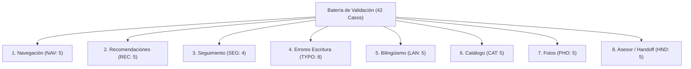

# Plan de Validación Técnica y Funcional — Revisión Desplegada en WhatsApp

**Proyecto:** Automatización del Servicio al Cliente en Texeira Travel Tour mediante Agente Conversacional RAG  
**Fecha:** 8 de octubre de 2026  
**Revisión en Cloud Run:** `texeira-whatsapp-00047-khb`  
**Estado del Servicio:** Activo (100% de tráfico asignado, endpoint `/health` respondiendo HTTP 200 OK tras inicio)
**URL de Producción:** `https://texeira-whatsapp-a5uzavilla-uc.a.run.app`  
**Base de Código Desplegada:** Commit `9bc1175` / `10f3344` (documentado en [docs/VERIFICACION_FORMULARIO_00047_20261004.md](file:///c:/Users/HP/Desktop/Chat%20bot/texeira-prueba-v4-evidencias/docs/VERIFICACION_FORMULARIO_00047_20261004.md))  
**Rama de Trabajo:** `feature/prep-validacion-whatsapp-00047` (conforme a [AGENTS.md](file:///c:/Users/HP/Desktop/Chat%20bot/AGENTS.md))  

---

## 1. Identificación y Estado de la Revisión Desplegada

| Parámetro | Valor Verificado en Nube | Observación Técnica |
| :--- | :--- | :--- |
| **Servicio Cloud Run** | `texeira-whatsapp` | Gestionado en Google Cloud Run, región `us-central1` |
| **Proyecto GCP** | `texeira-whatsapp-bot` | Entorno de producción del bot de WhatsApp |
| **Revisión Activa** | `texeira-whatsapp-00047-khb` | `latestCreatedRevisionName = latestReadyRevisionName` |
| **Distribución de Tráfico** | **100%** a `00047-khb` | Tráfico completo enrutado a la revisión vigente |
| **Salud de Servicio (`/health`)** | **HTTP 200** `{"status":"ok"}` | 200 OK confirmado en reintento; el arranque en frío (cold start) puede tardar hasta 25 s si escala desde cero |
| **Escalabilidad** | `min-instances = 0`, `max-instances = 2` | Escala a cero en reposo para minimizar costes de cómputo inactivo |
| **Aceleración de Inicio** | `startup-cpu-boost = true`, 2 GiB RAM | Aceleración de CPU activa durante el arranque inicial |
| **Secretos en Secret Manager** | Mapeados por variables | `LLM_PROVIDER`, `DATABASE_URL`, `META_*`, `ADMIN_PASSWORD` |

### Consideraciones sobre Costos e Infraestructura de Cloud Run
- La directiva `min-instances = 0` reduce el consumo cuando no hay peticiones activas, pero **no garantiza una factura nula ($0.00)**.
- Conforme a los [precios oficiales de Cloud Run](https://cloud.google.com/run/pricing), el costo final está sujeto a:
  1. Tiempo de CPU y memoria consumido durante el procesamiento de solicitudes y arranques en frío.
  2. Volumen total de solicitudes entrantes (incluyendo webhooks de Meta y healthchecks).
  3. Transferencia de red saliente (*egress*) hacia las APIs de Meta y respuestas multimedia.
  4. Llamadas a Secret Manager y retención de registros en Cloud Logging.
  5. Consumo que sobrepase la cuota gratuita mensual de Google Cloud (2M solicitudes, 360,000 GiB-s, 180,000 vCPU-s).

### Delimitación de Cambios Posteriores en el Repositorio
- La revisión `00047-khb` contiene la base de aplicación integrada hasta el commit `9bc1175` (cierre funcional del formulario de catálogo, guardado de tarifas, deduplicación de webhooks y protección anti-eco).
- Los commits posteriores en la rama `main` (`8d4823e`, `a1b9c60`, `dbe5498`, `04e864a`, `6af1ebd`) afectaron **única y exclusivamente** al evaluador académico offline ([tests/evaluate_thesis_postest.py](file:///c:/Users/HP/Desktop/Chat%20bot/texeira-prueba-v4-evidencias/tests/evaluate_thesis_postest.py)), a sus pruebas de polaridad de negaciones y a los documentos de informe recalibrado.
- Dichos arreglos del evaluador **están cerrados (37 pruebas aprobadas)** y no alteraron el código de la aplicación web ni requirieron un nuevo despliegue. Por tanto, la versión activa en WhatsApp objeto de esta validación es `00047-khb`.

---

## 2. Contexto Metodológico y Preservación de Históricos

1. **El resultado del 73,3% (22/30 aprobados):**
   - Corresponde estrictamente a la recalificación estricta de las **30 respuestas históricas capturadas el 21 de septiembre de 2026** bajo la revisión `00021-9mp` con Groq Qwen.
   - Refleja deficiencias de respuestas antiguas del modelo (como paradas omitidas en el City Tour o respuestas genéricas de incertidumbre) evaluadas con la rúbrica estricta en 4 dimensiones tras corregir las reglas de polaridad del calificador en `6af1ebd`.
   - **No describe ni mide la precisión actual de la versión `00047-khb` en producción**, la cual incorpora enrutamiento determinista por evidencias, catálogo dinámico sincronizado, corrección de bucles y control estricto de intenciones.
2. **Integridad de evidencias históricas:**
   - Los archivos [docs/evaluaciones/RESULTADOS_POSPRUEBA_TESIS_20260921.json](file:///c:/Users/HP/Desktop/Chat%20bot/texeira-prueba-v4-evidencias/docs/evaluaciones/RESULTADOS_POSPRUEBA_TESIS_20260921.json) y [docs/evaluaciones/RESULTADOS_POSPRUEBA_TESIS_20261004_RECALIBRADO.json](file:///c:/Users/HP/Desktop/Chat%20bot/texeira-prueba-v4-evidencias/docs/evaluaciones/RESULTADOS_POSPRUEBA_TESIS_20261004_RECALIBRADO.json) se mantienen intactos con sus hashes SHA-256 preservados.
   - Este plan no sobrescribe ni sustituye ningún resultado histórico.

---

## 3. Separación Rigurosa de las Tres Modalidades de Prueba

Para evitar confusiones metodológicas, cada caso de prueba se asigna a la modalidad técnica que efectivamente lo acredita:

```
┌────────────────────────────────────────────────────────────────────────────────────────────────┐
│                                   MODALIDADES DE VALIDACIÓN                                    │
├──────────────────────────┬───────────────────────────────┬─────────────────────────────────────┤
│ 1. Pruebas Aisladas      │ 2. Pruebas API / Sintéticas   │ 3. Pruebas Reales de WhatsApp       │
│ (Offline / Isolated)     │ (Webhook / HTTP Interno)      │ (End-to-End en Producción)          │
├──────────────────────────┼───────────────────────────────┼─────────────────────────────────────┤
│ • Ejecutadas vía         │ • Ejecutadas enviando         │ • Ejecutadas desde cliente WhatsApp │
│   tests/run_isolated.py  │   payloads JSON al endpoint   │   móvil real hacia el número de     │
│ • Red externa bloqueada  │   del webhook o /test-chat    │   producción de Texeira Travel.     │
│ • SQLite temporal        │ • Valida contratos HTTP,      │ • Valida entrega final en app Meta, │
│ • FakeLLM / mocks        │   firmas HMAC, estados en BD  │   renderizado de botones nativos,   │
│ • Acredita lógica pura,  │   PostgreSQL y respuestas     │   visualización de fotos adjuntas,  │
│   mutaciones de tarifas  │   estructuradas.              │   latencia percibida de red y       │
│   sintéticas y contratos │ • Acredita middleware, rutas  │   notificaciones push reales al     │
│   sin tocar producción.  │   y formato de carga útil.    │   asesor humano.                    │
└──────────────────────────┴───────────────────────────────┴─────────────────────────────────────┘
```

---

## 4. Criterios de Aprobación y Fuentes de Contraste Factual

Cada expectativa se contrasta estrictamente contra las fuentes oficiales y la implementación real del código, **sin inventar condiciones ni promesas comerciales**:

1. **Catálogo Oficial y Distinción de Estados:**
   - *Choquequirao Trek:* Es un **producto confirmado en F2** (catálogo PDF, pág. 11, duración documentada de 4 días). Sin embargo, en la base de datos operativa se encuentra **desactivado (`is_active = 0`)** al no tener salidas comerciales abiertas. El bot debe informar cortésmente que no figura actualmente en el catálogo activo y remitir a un asesor para coordinar, en lugar de afirmar erróneamente que no es un producto de Texeira.
   - *Precios Oficiales:* Solo Camino Inca Clásico tiene precio documentado fijo ($790 USD en F2). Tours como City Tour, Valle Sagrado o Humantay no cuentan con precio oficial cerrado en F1/F2. Para probar actualización de tarifas dinámicas se utiliza un **tour sintético en prueba aislada**; nunca se inyectan datos ficticios (ej. USD 120) en el catálogo de producción.
   - *Duraciones Canónicas:* Salkantay Trek figura en F2 como `4 días; noches no confirmadas`. Tours como Cañón del Colca y Machu Picchu by Car registran `2 días / 1 noche`. City Tour figura como `Medio día`.
   - *Inclusiones:* Se expresan según F1/F2 (ej. `guía profesional` o `guía profesional bilingüe`). No se promete `guía certificado` si la fuente no lo estipula.
2. **Botones Interactivos de WhatsApp:**
   - Máximo **3 botones por mensaje interactivo** (restricción estricta de Meta Graph API).
   - Estructura de IDs generados por `get_quick_buttons`:
     - Ficha de tour: `btn_inc:{eid}:{lang}` (📄 Qué incluye), `btn_photo:{eid}:{lang}` (📸 Ver Fotos), `btn_book:{eid}:{lang}` (Solicitar reserva).
     - Menú general: `btn_tours:{lang}` (🗺️ Ver Tours), `btn_advisor:{lang}` (🙋‍♂️ Asesor).
     - Categorías: `btn_cats:{lang}` (⬅️ Categorías), `btn_cat_page:{cat}:{page}:{lang}` (➡️ Más tours).
   - Títulos de botones estrictamente $\le 20$ caracteres.
3. **Gestión de Tickets y Handoff:**
   - Todo ticket nuevo se inicializa en estado **`pending`** (no `open`).
   - Con PostgreSQL configurado (Cloud Run con Neon), los tickets se almacenan en la tabla **`requests`** (conmutada por `db_adapter.py`). `human_requests.db` opera únicamente como fallback local en SQLite.
   - Texto de confirmación al turista: informa que la solicitud queda registrada y pendiente de atención humana, sin prometer atención "inmediata".
4. **Memoria Conversacional:**
   - `MAX_HISTORY_TURNS = 10` gestiona **20 mensajes en total** (10 pares de interacción usuario + asistente), no 20 turnos completos.
5. **Respuesta ante Fotos No Disponibles:**
   - Texto exacto generado por el sistema: *"Actualmente no disponemos de fotos en línea para [Tour], pero nuestro asesor te compartirá nuestra galería completa."* (No inventar *"galería en preparación"*).

---

## 5. Matriz Completa de los 42 Casos de Prueba



---

### Dimensión 1: Navegación e Interacción (NAV-01 a NAV-05)

| ID | Escenario / Propósito | Precondición y Contexto Inicial | Entrada del Turista (Input) | Comportamiento Esperado y Contraste | Modalidad Principal |
| :--- | :--- | :--- | :--- | :--- | :---: |
| **NAV-01** | Menú inicial y saludo | Chat nuevo, sin historial previo. | `Hola` | Saludo breve (< 160 chars), mención a Texeira Travel y máx 2 botones: `btn_tours:es` ("🗺️ Ver Tours") y `btn_advisor:es` ("🙋‍♂️ Asesor"). Ruta: `social`. | WhatsApp Real / API |
| **NAV-02** | Menú de categorías | Usuario visualiza opciones generales. | `btn_tours:es` o `Ver categorías de tours` | Despliega categorías disponibles y hasta 3 botones de categoría: `btn_cat:treks:es`, `btn_cat:cusco:es`, `btn_cat:reg:es`. Ruta: `evidence_listing`. | WhatsApp Real / API |
| **NAV-03** | Paginación de categoría | Categoría Treks seleccionada en página 0. | `btn_cat_page:treks:1:es` o `categoria treks pagina 1` | Lista tours de la página (ej. Camino Inca, Salkantay) con botones máx 3: `btn_tour:camino-inka:es`, `btn_cat_page:treks:2:es`, `btn_cats:es`. Ruta: `evidence_category_tours`. | WhatsApp Real / API |
| **NAV-04** | Ficha general del tour | Turista selecciona un tour de la lista. | `btn_tour:camino-inka:es` o `informacion de Camino Inca` | Resumen del tour, duración canónica (4 días / 3 noches) y botones máx 3: `btn_inc:camino-inka:es`, `btn_photo:camino-inka:es`, `btn_book:camino-inka:es`. Ruta: `evidence_tour_overview`. | WhatsApp Real / API |
| **NAV-05** | Preservación cruzada de entidad | Historial contiene consulta de Tour A (`camino-inka`) y luego Tour B (`city-tour-cusco`). | Clic en botón residual de A: `btn_inc:camino-inka:es` | Responde con inclusiones de Camino Inca (transporte, tren, ingresos, guía profesional) sin desvío hacia City Tour. Ruta: `evidence_includes`. | WhatsApp Real / API |

---

### Dimensión 2: Motor de Recomendaciones (REC-01 a REC-05)

| ID | Escenario / Propósito | Precondición y Contexto Inicial | Entrada del Turista (Input) | Comportamiento Esperado y Contraste | Modalidad Principal |
| :--- | :--- | :--- | :--- | :--- | :---: |
| **REC-01** | Petición abierta de recomendación | Chat nuevo, sin preferencias indicadas. | `¿Qué tours me recomiendas?` | Pregunta breve por preferencias (paisajes, sitios históricos, caminatas; tiempo disponible) y botones de apoyo (`btn_tours:es`, `btn_advisor:es`). Ruta: `evidence_recommendation`. | WhatsApp Real / API |
| **REC-02** | Filtro estricto por duración | Chat nuevo. | `Recomiéndame un tour de 2 días` | Recomienda tours verificados de 2 días (*Cañón del Colca 2D/1N*, *Machu Picchu by Car 2D/1N*). **Exclusión total** de tours de 4 días (Camino Inca) o medio día. Ruta: `evidence_recommendation`. | WhatsApp Real / API |
| **REC-03** | Filtro negativo de actividad | Chat nuevo. | `No quiero caminatas` | Sugiere opciones de bajo impacto (*City Tour*, *Colca*, *Titicaca*, *Machu Picchu by Car*). **Exclusión total** de trekkings de altura (Humantay, 7 Colores, Salkantay). Ruta: `evidence_recommendation`. | WhatsApp Real / API |
| **REC-04** | Acumulación de restricciones | Historial con turno previo `No quiero caminatas`. | `Un día` | Sugiere tours de 1 día sin caminatas (*Titicaca*, *Machu Picchu en Tren*, *Q’eswachaca*, *Ruta del Sol*). Mantiene la exclusión de senderismo sin resetear memoria. Ruta: `evidence_recommendation`. | WhatsApp Real / API |
| **REC-05** | Rechazo y solicitud de alternativas | El bot emitió una lista previa de recomendaciones. | `Ninguno, necesito que me recomiendes otras opciones` | Ofrece alternativas distintas del catálogo activo sin entrar en bucle ni asumir la lista previa como selección del turista. Ruta: `evidence_recommendation`. | WhatsApp Real / API |

---

### Dimensión 3: Seguimiento y Memoria Contextual (SEG-01 a SEG-04)

| ID | Escenario / Propósito | Precondición y Contexto Inicial | Entrada del Turista (Input) | Comportamiento Esperado y Contraste | Modalidad Principal |
| :--- | :--- | :--- | :--- | :--- | :---: |
| **SEG-01** | Seguimiento elíptico de precio | Contexto activo centrado en `camino-inka`. | `¿y el precio?` | Responde con la tarifa oficial documentada de F2 ($790 USD para Camino Inca Clásico 4D/3N) sin pedir que repita el nombre del tour. Ruta: `evidence_confirmed_price`. | WhatsApp Real / API |
| **SEG-02** | Seguimiento elíptico de horario | Contexto activo centrado en `valle-sagrado`. | `¿y a qué hora sale?` | Informa el horario canónico oficial de F1 (`07:30 – 18:30`) asociado a Valle Sagrado. Ruta: `evidence_schedule`. | WhatsApp Real / API |
| **SEG-03** | Referencia comparativa ambigua | Usuario menciona dos destinos en el mismo turno. | `Me gusta el Camino Inca pero también el City Tour. ¿Tienes fotos del otro?` | Detecta ambigüedad inherente entre ambas opciones y solicita precisar educadamente de cuál de los dos tours desea fotos. Ruta: `evidence_ambiguous`. | WhatsApp Real / API |
| **SEG-04** | Límite de memoria conversacional | Conversación acumulando 10 turnos (20 mensajes human+ai). | Consulta de dato previo en el turno 11 | Conserva los últimos 20 mensajes (10 pares), podando los mensajes anteriores a esa ventana sin desbordar memoria ni lanzar excepciones. | Pruebas Aisladas / API |

---

### Dimensión 4: Errores de Escritura y Variantes Ortográficas (TYPO-01 a TYPO-08)

| ID | Entrada del Turista (Input) | Normalización Interna | Comportamiento Esperado y Contraste | Modalidad Principal |
| :--- | :--- | :--- | :--- | :---: |
| **TYPO-01** | `cuanto cuesta machu pichu` | `cuanto cuesta machu picchu` | Mapea a `machu-picchu-tren` / `machu-picchu-car` y entrega datos de cotización sin caer en fallback genérico. | WhatsApp Real / API |
| **TYPO-02** | `q incluye el tour del valle sagrao` | `q incluye el tour del valle sagrado` | Mapea a `valle-sagrado` y entrega inclusiones de F2/F3 (transporte, guía, almuerzo). | WhatsApp Real / API |
| **TYPO-03** | `a ke hora sale el city tour` | Limpieza de caracteres | Identifica intención de horario y entrega los turnos oficiales de F1 (`10:00-14:00` y `13:30-18:30`). | WhatsApp Real / API |
| **TYPO-04** | `kiero ir a la montaña de colores cuanto es` | Normalización léxica | Mapea a `montana-7-colores` y brinda información documental de tarifas. | WhatsApp Real / API |
| **TYPO-05** | `trekking a salkantai` | `trekking a salkantay` | Mapea a `salkantay-trek` y entrega ficha con duración documentada de 4 días (noches por confirmar según F2). | WhatsApp Real / API |
| **TYPO-06** | `laguna umantay precio` | `laguna humantay precio` | Mapea a `laguna-humantay` y aclara estado de cotización en agencia. | WhatsApp Real / API |
| **TYPO-07** | `¿¿¿cuanto cuesta machu pichu???` | Limpieza de signos | Remueve signos redundantes y procesa la consulta de tarifas de Machu Picchu. | WhatsApp Real / API |
| **TYPO-08** | `wat time does the tour start` (Inglés) | Preservación de inglés | **Preserva el texto en inglés intacto**; no lo altera con reglas de normalización en español. Solicita especificar tour. | WhatsApp Real / API |

---

### Dimensión 5: Bilingüismo y Correspondencia Lingüística (LAN-01 a LAN-05)

| ID | Idioma | Precondición y Contexto | Entrada del Turista (Input) | Comportamiento Esperado y Contraste | Modalidad Principal |
| :--- | :---: | :--- | :--- | :--- | :---: |
| **LAN-01** | ES | Chat en español. | `¿Qué incluye Machu Picchu en tren?` | Respuesta 100% en español: traslado Cusco-Ollanta-Cusco, tren ida y vuelta, bus subida/bajada, entradas, guía profesional (F1). $\text{CI} = 1.0$. Ruta: `evidence_includes`. | WhatsApp Real / API |
| **LAN-02** | EN | Chat en inglés. | `What does Machu Picchu by train include?` | Respuesta 100% en inglés: round-trip train, round-trip bus, entrance ticket, professional guide. Cero plantillas en español. $\text{CI} = 1.0$. Ruta: `evidence_includes`. | WhatsApp Real / API |
| **LAN-03** | EN | Chat en inglés. | `What tours do you recommend for 1 day?` | Recomendaciones idiomáticas en inglés con duraciones traducidas (1 day, Full day). $\text{CI} = 1.0$. Ruta: `evidence_recommendation`. | WhatsApp Real / API |
| **LAN-04** | EN | Chat en inglés. | `Can I pay with PayPal or credit card?` | Manejo honesto de incertidumbre en inglés: aclara que pagos directos se coordinan con la agencia (*Write advisor*). $\text{MI} = 1.0$, $\text{CI} = 1.0$. Ruta: `evidence_unknown`. | WhatsApp Real / API |
| **LAN-05** | EN | Chat en inglés. | `I want to speak with an agent` | Confirmación de ticket en inglés: *Your request [id] is registered and pending human attention.* Botones de soporte en inglés. $\text{CI} = 1.0$. | WhatsApp Real / API |

---

### Dimensión 6: Catálogo Actualizado y Fidelidad Factual (CAT-01 a CAT-05)

| ID | Escenario / Propósito | Precondición y Contexto | Entrada del Turista (Input) | Comportamiento Esperado y Contraste | Modalidad Principal |
| :--- | :--- | :--- | :--- | :--- | :---: |
| **CAT-01** | Paradas canónicas de City Tour | Consulta factual de recorrido. | `¿Cuáles son los lugares que se visitan en el City Tour?` | Lista las 5 paradas oficiales de F1/F2: Sacsayhuamán, Qenqo, Puka Pukara, Tambomachay y Koricancha. $\text{FF} = 1.0$. | WhatsApp Real / API |
| **CAT-02** | Horario oficial de Valle Sagrado | Consulta factual de horario. | `¿Qué horario tiene Valle Sagrado?` | Responde con el horario canónico confirmado de F1: `07:30 – 18:30`. Resuelve discrepancia histórica F1 vs F3 a favor de F1. $\text{FF} = 1.0$. | WhatsApp Real / API |
| **CAT-03** | Métodos de pago no documentados | Consulta de políticas comerciales. | `¿Aceptan Yape o Plin?` | Declara honestamente que no figura documentado en catálogo y remite a coordinar con la agencia. $\text{MI} = 1.0$. Cero invención. Ruta: `evidence_unknown`. | WhatsApp Real / API |
| **CAT-04** | Choquequirao: producto confirmado vs tour inactivo | Consulta sobre Choquequirao. | `¿Tienen tour a Choquequirao?` | Reconoce que Choquequirao es un producto documentado en F2 (4 días), pero aclara que **no figura actualmente en el catálogo activo** de salidas. Remite cortésmente al asesor. Ruta: `evidence_inactive_tour`. | WhatsApp Real / API |
| **CAT-05** | Tarifas dinámicas del panel (Datos Aislados) | BD SQLite temporal aislada (`run_isolated.py`), tour de prueba sintético con tarifa modificada. | `¿Cuál es el precio de [Tour Sintético]?` | El bot devuelve la tarifa actualizada guardada en base de datos sin requerir reinicio del servidor. **No se ejecuta en producción con datos ficticios.** | Pruebas Aisladas |

---

### Dimensión 7: Despacho Multimedia de Fotos y Folletos (PHO-01 a PHO-05)

| ID | Escenario / Propósito | Precondición y Contexto | Entrada del Turista (Input) | Comportamiento Esperado y Contraste | Modalidad Principal |
| :--- | :--- | :--- | :--- | :--- | :---: |
| **PHO-01** | Solicitud afirmativa de foto | Tour activo con imagen configurada (`city-tour-cusco`). | `¿Tienen fotos del City Tour?` | Despacha la imagen oficial asociada (`city_tour_cusco.jpg`) con caption oficial (*City Tour Cusco — Texeira Travel*). `is_photo_requested = True`. Ruta: `evidence_photo`. | WhatsApp Real / API |
| **PHO-02** | Solicitud afirmativa de foto en inglés | Tour activo con imagen (`machu-picchu-tren`). | `Can you show me photos of Machu Picchu?` | Envía fotografía oficial de Machu Picchu con pie de foto descriptivo. Detección multilingüe afirmativa. Ruta: `evidence_photo`. | WhatsApp Real / API |
| **PHO-03** | Filtro anti-spam ante saludos y listas | Consulta general. | `Hola, ¿qué tours ofrecen?` | Entrega listado textual y botones interactivos. **Cero fotos enviadas** (0 falsos positivos). | WhatsApp Real / API |
| **PHO-04** | Respeto de negación explícita de fotos | Consulta de información general. | `Información de Humantay, pero por favor sin fotos` | Entrega texto informativo del tour. **Cero fotos enviadas**. El filtro de negación descarta el despacho multimedia. | WhatsApp Real / API |
| **PHO-05** | Tour sin fotografía en línea | Tour sin asset fotográfico disponible (`camino-inka` sin imagen). | `Fotos de Camino Inca` | Respuesta exacta del sistema: *"Actualmente no disponemos de fotos en línea para Camino Inca Clásico 4D/3N, pero nuestro asesor te compartirá nuestra galería completa."* Ruta: `evidence_photo_unavailable`. | WhatsApp Real / API |

---

### Dimensión 8: Derivación al Asesor Humano (HND-01 a HND-05)

| ID | Escenario / Propósito | Precondición y Contexto | Entrada del Turista (Input) | Comportamiento Esperado y Contraste | Modalidad Principal |
| :--- | :--- | :--- | :--- | :--- | :---: |
| **HND-01** | Solicitud directa en español | Chat sin ticket previo. | `Quiero hablar con un asesor humano` | Crea ticket en tabla `requests` con estado **`pending`**, canal `whatsapp`, y confirma: *"Tu solicitud [id] está registrada y pendiente de atención humana. Aún no ha sido atendida..."*. | WhatsApp Real / API |
| **HND-02** | Solicitud directa en inglés | Chat en inglés sin ticket previo. | `I need to speak with an advisor please` | Crea ticket en tabla `requests` con estado **`pending`**, canal `whatsapp`, y confirma en inglés: *"Your request [id] is registered and pending human attention..."*. $\text{CI} = 1.0$. | WhatsApp Real / API |
| **HND-03** | Reintento de solicitud (Deduplicación) | Usuario con ticket activo previo en estado `pending`. | Envío de `asesor` por segunda vez | Retorna el mismo ticket existente sin crear registros duplicados en la tabla `requests`. | WhatsApp Real / API |
| **HND-04** | Negación de asesor | Consulta de información con mención negativa. | `No quiero hablar con un asesor, solo quiero saber el horario del City Tour` | Procesa la consulta de horario normalmente. **No escala a humano** ni crea ticket (`escalated_to_human = False`). | WhatsApp Real / API |
| **HND-05** | Solicitud de reserva de tour | Clic en botón interactivo de reserva. | `btn_book:camino-inka:es` (mapeado a `solicitar reserva de Camino Inca Clásico 4D/3N`) | Registra ticket de reserva en tabla `requests` con estado **`pending`** y contexto `[Reserva - Camino Inca Clásico 4D/3N]`. Informa que la reserva está pendiente de revisión por un asesor. | WhatsApp Real / API |

---

## 6. Procedimiento de Ejecución y Registro de los 42 Casos

El protocolo de ejecución exige documentar el resultado observado de **cada uno de los 42 casos** sin omitir ninguno. Inicialmente, todos los casos quedan registrados como **`No ejecutado`**:

| ID | Modalidad | Precondición / Contexto Inicial | Entrada (Input) | Fuente de Contraste | Motor Observable | Respuesta Observada | Resultado | Evidencia |
| :--- | :---: | :--- | :--- | :---: | :---: | :---: | :---: | :---: |
| **NAV-01** | Real / API | Chat nuevo, sin historial. | `Hola` | Código app.py | Reglas (`social`) | *[Pendiente de ejecución]* | No ejecutado | — |
| **NAV-02** | Real / API | Menú de inicio visualizado. | `btn_tours:es` | F1 / Código | Reglas (`evidence_listing`) | *[Pendiente de ejecución]* | No ejecutado | — |
| **NAV-03** | Real / API | Categoría Treks seleccionada pág 0. | `btn_cat_page:treks:1:es` | Catálogo / Código | Reglas (`evidence_category_tours`) | *[Pendiente de ejecución]* | No ejecutado | — |
| **NAV-04** | Real / API | Selección de Camino Inca. | `btn_tour:camino-inka:es` | F2 / Código | Reglas (`evidence_tour_overview`) | *[Pendiente de ejecución]* | No ejecutado | — |
| **NAV-05** | Real / API | Historial con Camino Inca y City Tour. | Clic `btn_inc:camino-inka:es` | F2 / Código | Reglas (`evidence_includes`) | *[Pendiente de ejecución]* | No ejecutado | — |
| **REC-01** | Real / API | Chat nuevo sin preferencias. | `¿Qué tours me recomiendas?` | Código verified_routes | Reglas (`evidence_recommendation`) | *[Pendiente de ejecución]* | No ejecutado | — |
| **REC-02** | Real / API | Chat nuevo. | `Recomiéndame un tour de 2 días` | F2 / catalog_service | Reglas (`evidence_recommendation`) | *[Pendiente de ejecución]* | No ejecutado | — |
| **REC-03** | Real / API | Chat nuevo. | `No quiero caminatas` | F1 / F2 | Reglas (`evidence_recommendation`) | *[Pendiente de ejecución]* | No ejecutado | — |
| **REC-04** | Real / API | Restricción previa `No quiero caminatas`. | `Un día` | F1 / F2 | Reglas (`evidence_recommendation`) | *[Pendiente de ejecución]* | No ejecutado | — |
| **REC-05** | Real / API | Recomendaciones previas emitidas. | `Ninguno, necesito que me recomiendes otras opciones` | Código verified_routes | Reglas (`evidence_recommendation`) | *[Pendiente de ejecución]* | No ejecutado | — |
| **SEG-01** | Real / API | Tour activo: `camino-inka`. | `¿y el precio?` | F2 pág. 14 ($790 USD) | Reglas (`evidence_confirmed_price`) | *[Pendiente de ejecución]* | No ejecutado | — |
| **SEG-02** | Real / API | Tour activo: `valle-sagrado`. | `¿y a qué hora sale?` | F1 folleto físico | Reglas (`evidence_schedule`) | *[Pendiente de ejecución]* | No ejecutado | — |
| **SEG-03** | Real / API | Dos tours mencionados por el usuario. | `Me gusta el Camino Inca pero también el City Tour. ¿Tienes fotos del otro?` | Código app.py | Reglas (`evidence_ambiguous`) | *[Pendiente de ejecución]* | No ejecutado | — |
| **SEG-04** | Aislada / API | 10 turnos previos (20 mensajes). | Consulta de dato previo en turno 11 | app.py (`MAX_HISTORY_TURNS`) | Memoria / Reglas | *[Pendiente de ejecución]* | No ejecutado | — |
| **TYPO-01** | Real / API | Chat nuevo. | `cuanto cuesta machu pichu` | app.py normalizador | Reglas / RAG | *[Pendiente de ejecución]* | No ejecutado | — |
| **TYPO-02** | Real / API | Chat nuevo. | `q incluye el tour del valle sagrao` | F2 / normalizador | Reglas (`evidence_includes`) | *[Pendiente de ejecución]* | No ejecutado | — |
| **TYPO-03** | Real / API | Chat nuevo. | `a ke hora sale el city tour` | F1 / normalizador | Reglas (`evidence_schedule`) | *[Pendiente de ejecución]* | No ejecutado | — |
| **TYPO-04** | Real / API | Chat nuevo. | `kiero ir a la montaña de colores cuanto es` | F2 / normalizador | Reglas / RAG | *[Pendiente de ejecución]* | No ejecutado | — |
| **TYPO-05** | Real / API | Chat nuevo. | `trekking a salkantai` | F2 pág. 15 / normalizador | Reglas (`evidence_tour_overview`) | *[Pendiente de ejecución]* | No ejecutado | — |
| **TYPO-06** | Real / API | Chat nuevo. | `laguna umantay precio` | F1 / normalizador | Reglas (`evidence_unknown`) | *[Pendiente de ejecución]* | No ejecutado | — |
| **TYPO-07** | Real / API | Chat nuevo. | `¿¿¿cuanto cuesta machu pichu???` | app.py normalizador | Reglas / RAG | *[Pendiente de ejecución]* | No ejecutado | — |
| **TYPO-08** | Real / API | Chat nuevo en inglés. | `wat time does the tour start` | verified_routes | Reglas / LLM | *[Pendiente de ejecución]* | No ejecutado | — |
| **LAN-01** | Real / API | Chat en español. | `¿Qué incluye Machu Picchu en tren?` | F1 / F3 | Reglas (`evidence_includes`) | *[Pendiente de ejecución]* | No ejecutado | — |
| **LAN-02** | Real / API | Chat en inglés. | `What does Machu Picchu by train include?` | F1 / F3 traducción | Reglas (`evidence_includes`) | *[Pendiente de ejecución]* | No ejecutado | — |
| **LAN-03** | Real / API | Chat en inglés. | `What tours do you recommend for 1 day?` | F1 / F2 traducción | Reglas (`evidence_recommendation`) | *[Pendiente de ejecución]* | No ejecutado | — |
| **LAN-04** | Real / API | Chat en inglés. | `Can I pay with PayPal or credit card?` | F1 / F2 / F3 | Reglas (`evidence_unknown`) | *[Pendiente de ejecución]* | No ejecutado | — |
| **LAN-05** | Real / API | Chat en inglés. | `I want to speak with an agent` | handoff_support.py | Reglas (`human_request`) | *[Pendiente de ejecución]* | No ejecutado | — |
| **CAT-01** | Real / API | Consulta de paradas de City Tour. | `¿Cuáles son los lugares que se visitan en el City Tour?` | F1 / F2 paradas | Reglas / RAG | *[Pendiente de ejecución]* | No ejecutado | — |
| **CAT-02** | Real / API | Consulta de horario de Valle Sagrado. | `¿Qué horario tiene Valle Sagrado?` | F1 folleto físico | Reglas (`evidence_schedule`) | *[Pendiente de ejecución]* | No ejecutado | — |
| **CAT-03** | Real / API | Consulta de medios de pago. | `¿Aceptan Yape o Plin?` | F1 / F2 / F3 | Reglas (`evidence_unknown`) | *[Pendiente de ejecución]* | No ejecutado | — |
| **CAT-04** | Real / API | Consulta de Choquequirao. | `¿Tienen tour a Choquequirao?` | F2 pág. 11 / DB inactivo | Reglas (`evidence_inactive_tour`) | *[Pendiente de ejecución]* | No ejecutado | — |
| **CAT-05** | Aislada | Base temporal aislada con tour sintético. | `¿Cuál es el precio de [Tour Sintético]?` | catalog_service / SQLite | Reglas (`evidence_confirmed_price`) | *[Pendiente de ejecución]* | No ejecutado | — |
| **PHO-01** | Real / API | Tour activo: `city-tour-cusco`. | `¿Tienen fotos del City Tour?` | visual_engine.py asset | Visual Engine + Graph API | *[Pendiente de ejecución]* | No ejecutado | — |
| **PHO-02** | Real / API | Tour activo: `machu-picchu-tren`. | `Can you show me photos of Machu Picchu?` | visual_engine.py asset | Visual Engine + Graph API | *[Pendiente de ejecución]* | No ejecutado | — |
| **PHO-03** | Real / API | Consulta general de tours. | `Hola, ¿qué tours ofrecen?` | verified_routes.py | Reglas (`evidence_listing`) | *[Pendiente de ejecución]* | No ejecutado | — |
| **PHO-04** | Real / API | Consulta con negación de imagen. | `Información de Humantay, pero por favor sin fotos` | visual_engine.py | Visual Engine (filtro negación) | *[Pendiente de ejecución]* | No ejecutado | — |
| **PHO-05** | Real / API | Tour sin fotografía en catálogo. | `Fotos de Camino Inca` | visual_engine.py | Reglas (`evidence_photo_unavailable`) | *[Pendiente de ejecución]* | No ejecutado | — |
| **HND-01** | Real / API | Chat sin ticket previo. | `Quiero hablar con un asesor humano` | handoff_support / DB | Handoff Support (`pending`) | *[Pendiente de ejecución]* | No ejecutado | — |
| **HND-02** | Real / API | Chat en inglés sin ticket. | `I need to speak with an advisor please` | handoff_support / DB | Handoff Support (`pending`) | *[Pendiente de ejecución]* | No ejecutado | — |
| **HND-03** | Real / API | Usuario con ticket previo `pending`. | Envío de `asesor` por segunda vez | handoff_support / DB | Handoff Support (dedup) | *[Pendiente de ejecución]* | No ejecutado | — |
| **HND-04** | Real / API | Consulta con mención negativa de asesor. | `No quiero hablar con un asesor, solo quiero saber el horario del City Tour` | handoff_support.py | Reglas (`evidence_schedule`) | *[Pendiente de ejecución]* | No ejecutado | — |
| **HND-05** | Real / API | Botón de reserva interactivo. | `btn_book:camino-inka:es` | handoff_support / DB | Handoff Support (`pending`) | *[Pendiente de ejecución]* | No ejecutado | — |

---

## 7. Protocolo de Ejecución y Trazabilidad

1. **Pre-vuelo de Observabilidad:**
   - Monitoreo activo de Cloud Logging para el servicio `texeira-whatsapp`.
   - Extracción de identificadores `wamid` y latencias registradas en los logs `[WA PROCESSED]`.
2. **Registro de Respuestas Observadas:**
   - Cada respuesta obtenida se consignará en la columna correspondiente de la tabla de la Sección 6.
   - Se clasificará el motor que emitió la respuesta:
     - `Reglas`: Resuelto por `verified_routes.py` sin intervención de embeddings ni Groq.
     - `RAG`: Recuperación contextual desde base de hechos / índice Chroma/BM25.
     - `LLM`: Generación abierta mediante llamada al modelo configurado en Groq.
3. **Verificación de Persistencia:**
   - Comprobación de filas en la tabla `requests` en PostgreSQL (Neon) para los casos de handoff (HND-01, HND-02, HND-03, HND-05), verificando que su estado inicial sea estrictamente `pending`.
4. **Cierre de Resultados:**
   - La evaluación formal se documentará en un informe posterior de evidencias una vez concluida la interacción en vivo, sin alterar las referencias históricas consolidadas.
