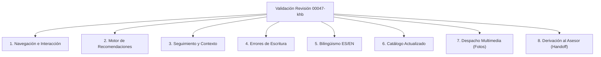

# Plan de Validación Técnica y Funcional — Revisión Desplegada en WhatsApp

**Proyecto:** Automatización del Servicio al Cliente en Texeira Travel Tour mediante Agente Conversacional RAG  
**Fecha:** 8 de octubre de 2026  
**Revisión en Cloud Run:** `texeira-whatsapp-00047-khb`  
**Estado del Servicio:** Activo (100% de tráfico, endpoint `/health` respondiendo HTTP 200 OK)  
**URL de Producción:** `https://texeira-whatsapp-a5uzavilla-uc.a.run.app`  
**Base de Código Desplegada:** Commit `9bc1175` / `10f3344` (documentado en [docs/VERIFICACION_FORMULARIO_00047_20261004.md](file:///c:/Users/HP/Desktop/Chat%20bot/texeira-prueba-v4-evidencias/docs/VERIFICACION_FORMULARIO_00047_20261004.md))  
**Rama de Trabajo:** `feature/prep-validacion-whatsapp-00047` (conforme a [AGENTS.md](file:///c:/Users/HP/Desktop/Chat%20bot/AGENTS.md))  

---

## 1. Identificación y Estado de la Revisión Desplegada

| Parámetro | Valor Verificado en Nube | Observación Técnica |
| :--- | :--- | :--- |
| **Servicio Cloud Run** | `texeira-whatsapp` | Gestionado en Google Cloud Run, región `us-central1` |
| **Proyecto GCP** | `texeira-whatsapp-bot` | Entorno de producción del bot de WhatsApp |
| **Revisión Activa** | `texeira-whatsapp-00047-khb` | `latestCreatedRevisionName = latestReadyRevisionName` |
| **Distribución de Tráfico** | **100%** a `00047-khb` | Tráfico completo enrutado a la revisión vigente |
| **Salud de Servicio (`/health`)** | **HTTP 200** `{"status":"ok"}` | Verificado en vivo mediante consulta directa de solo lectura |
| **Política de Costo $0.00** | `min-instances = 0`, `max-instances = 2` | Escala a cero en reposo; cero costos fijos |
| **Aceleración de Inicio** | `startup-cpu-boost = true`, 2 GiB RAM | Mitigación del cold start durante el arranque |
| **Secretos en Secret Manager** | Intactos y mapeados | `LLM_PROVIDER`, `DATABASE_URL`, `META_*`, `ADMIN_PASSWORD` |

### Delimitación de Cambios Posteriores en el Repositorio
- La revisión `00047-khb` contiene la base de aplicación integrada hasta el commit `9bc1175` (cierre funcional del formulario de catálogo y tarifas, rutas verificadas, deduplicación y anti-eco).
- Los commits posteriores en la rama `main` (`8d4823e`, `a1b9c60`, `dbe5498`, `04e864a`, `6af1ebd`) afectaron **única y exclusivamente** al evaluador académico offline ([tests/evaluate_thesis_postest.py](file:///c:/Users/HP/Desktop/Chat%20bot/texeira-prueba-v4-evidencias/tests/evaluate_thesis_postest.py)), a sus pruebas de polaridad de negaciones y a los documentos de informe recalibrado.
- Dichos arreglos del evaluador **están cerrados (37 pruebas aprobadas)** y no alteraron el código de la aplicación web ni requirieron un nuevo despliegue. Por tanto, la versión activa en WhatsApp a validar es `00047-khb`.

---

## 2. Contexto Metodológico y Preservación de Históricos

1. **El resultado del 73,3% (22/30 aprobados):**
   - Corresponde estrictamente a la recalificación estricta de las **30 respuestas históricas capturadas el 21 de septiembre de 2026** bajo la revisión `00021-9mp` con Groq Qwen.
   - Refleja deficiencias de respuestas antiguas del modelo (como paradas omitidas en el City Tour o respuestas genéricas de incertidumbre) evaluadas con la rúbrica estricta en 4 dimensiones tras corregir las reglas de polaridad del calificador en `6af1ebd`.
   - **No describe ni mide la precisión actual de la versión `00047-khb` en producción**, la cual incorpora enrutamiento determinista por evidencias, catálogo dinámico sincronizado, corrección de bucles y control estricto de intenciones.
2. **Integridad de evidencias históricas:**
   - Los archivos [docs/evaluaciones/RESULTADOS_POSPRUEBA_TESIS_20260921.json](file:///c:/Users/HP/Desktop/Chat%20bot/texeira-prueba-v4-evidencias/docs/evaluaciones/RESULTADOS_POSPRUEBA_TESIS_20260921.json) y [docs/evaluaciones/RESULTADOS_POSPRUEBA_TESIS_20261004_RECALIBRADO.json](file:///c:/Users/HP/Desktop/Chat%20bot/texeira-prueba-v4-evidencias/docs/evaluaciones/RESULTADOS_POSPRUEBA_TESIS_20261004_RECALIBRADO.json) se mantienen intactos con sus hashes SHA-256 preservados.
   - Este plan no sobrescribe ni sustituye ningún resultado histórico.

---

## 3. Diferenciación Estricta: Pruebas Simuladas vs. Pruebas Reales

| Característica | Pruebas Simuladas (Offline / Aisladas) | Pruebas Reales (WhatsApp en Vivo / Cloud Run) |
| :--- | :--- | :--- |
| **Entorno de Ejecución** | Local mediante [tests/run_isolated.py](file:///c:/Users/HP/Desktop/Chat%20bot/texeira-prueba-v4-evidencias/tests/run_isolated.py) | Teléfono inteligente con WhatsApp o API client hacia Cloud Run |
| **Conectividad Externa** | Red externa bloqueada (`socket` interceptado) | Conexión HTTPS real a Google Cloud Run y Meta Graph API |
| **Modelo de Lenguaje (LLM)** | `FakeLLM` o dobles de prueba sin costo | Groq API en la nube con modelo configurado (cuando no es atajo) |
| **Base de Datos** | SQLite temporal volátil (`tempfile`) | Base PostgreSQL en Neon / SQLite persistente en Cloud Run |
| **Qué Acreditan** | Lógica determinista de rutas (`verified_routes`), filtros de regex, deduplicación de tickets, prevención de bucles, contratos CSRF/API. | Latencia percibida real (cold start + LLM), renderizado de mensajes interactivos en WhatsApp, visualización de fotos, estabilidad del webhook ante reintentos de Meta. |
| **Costo y Consumo** | **Costo $0.00**, 0 tokens consumidos | Consumo mínimo de tokens Groq según cuota; costo Cloud Run $0.00 |
| **Límites de Validez** | No prueban variabilidad estocástica del LLM ni caídas de red | Requieren números de prueba designados y monitoreo de logs |

> [!IMPORTANT]
> **Esta fase preparatoria no realiza llamadas a Groq ni despliega cambios a Cloud Run.** Organiza los escenarios, entradas exactas, aserciones y criterios de éxito que regirán la validación formal.

---

## 4. Matriz de Casos de Prueba y Criterios de Aprobación

La validación de la revisión `texeira-whatsapp-00047-khb` se estructura en 8 dimensiones operativas esenciales:



---

### Dimensión 1: Navegación e Interacción de Botones (NAV)

Evalúa la interacción estructurada vía botones interactivos (`quick_reply`, `button_reply`, `list_reply`), paginación y ausencia de bucles o enlaces comerciales muertos.

| ID | Escenario / Flujo | Entrada del Turista (Input) | Comportamiento Esperado | Criterio de Aprobación Estricto | Modalidad |
| :--- | :--- | :--- | :--- | :--- | :---: |
| **NAV-01** | Menú inicial y categorías | Mensaje inicial: `Hola` o botón `Ver Tours` | Presenta bienvenida concisa (< 160 caracteres), mención a Texeira Travel y menú de categorías (Cusco, Machu Picchu, Treks, etc.). | Respuesta sin disclaimers genéricos de IA; ruta `social` o `evidence_listing`; incluye CTA para asesor. | Simulada y Real |
| **NAV-02** | Navegación por categoría y paginación | Botón `categoria treks` seguido de `categoria treks pagina 2` | Despliega los tours de la categoría en lotes paginados con botones de navegación (`Siguiente`, `Anterior`, `Ver Categorías`). | Paginación correcta sin repetición de tours; ruta `evidence_category_tours`; cero loops infinitos. | Simulada y Real |
| **NAV-03** | Ficha de tour y opciones | Botón `btn_tour:city-tour-cusco:es` o `informacion de City Tour Cusco` | Presenta la ficha del tour con resumen, duración y botones interactivos: `Tarifas`, `¿Qué incluye?`, `Horarios`, `Fotos`, `Solicitar Reserva`. | Ruta `evidence_tour_overview`; los botones apuntan a la entidad activa (`city-tour-cusco`); datos de F1/F2. | Simulada y Real |
| **NAV-04** | Preservación de entidad cruzada | Consulta Tour A (`Camino Inca`), luego Tour B (`City Tour`), luego pulsa botón residual de A (`que incluye Camino Inca`) | El bot responde con los datos del Tour A sin confundirse con el contexto de Tour B. | La entidad se extrae del botón interactivo (`btn_tour:camino-inka:includes`) sin desvío de entidad. | Simulada y Real |
| **NAV-05** | Gestión de tour inactivo | Pulsar botón antiguo de un tour desactivado en el panel (`Choquequirao Trek`) | Informa con cortesía que el tour no se encuentra disponible actualmente y ofrece volver al catálogo activo. | Ruta `evidence_inactive_tour`; NO ofrece botón de reserva ni tarifas activas; no falla el webhook. | Simulada y Real |

---

### Dimensión 2: Motor de Recomendaciones (REC)

Evalúa la capacidad de orientar al turista según restricciones de tiempo, tipo de actividad, condición física y preferencias, sin entrar en bucles de aclaración.

| ID | Escenario / Flujo | Entrada del Turista (Input) | Comportamiento Esperado | Criterio de Aprobación Estricto | Modalidad |
| :--- | :--- | :--- | :--- | :--- | :---: |
| **REC-01** | Petición abierta de recomendación | `¿Qué tours me recomiendas?` | Solicita brevemente preferencias: tipo de experiencia (paisajes, sitios históricos, caminatas) y tiempo disponible. | Ruta `evidence_recommendation`; respuesta concisa y orientadora sin listar arbitrariamente todo el catálogo. | Simulada y Real |
| **REC-02** | Filtro estricto por duración | `Recomiéndame un tour de 2 días` | Recomienda exclusivamente tours cuya duración sea de 2 días (ej. *Cañón del Colca 2D/1N*, *Machu Picchu by Car 2D/1N*). | **Exclusión total** de tours de medio día, 1 día o 4 días (ej. Camino Inca 4D/3N queda excluido). | Simulada y Real |
| **REC-03** | Filtro negativo de actividad | `No quiero caminatas` | Recomienda opciones de bajo impacto físico (City Tour, Valle Sagrado, Titicaca, Machu Picchu en tren). | **Exclusión total** de trekkings de altura (Laguna Humantay, Montaña de 7 Colores, Salkantay excluidos). | Simulada y Real |
| **REC-04** | Acumulación de restricciones | Turno 1: `No quiero caminatas`<br>Turno 2: `Tengo solo un día` | Recomienda tours de 1 día que NO requieran caminatas (Machu Picchu en tren, Titicaca Full Day, Ruta del Sol). | Conserva la restricción previa (`no quiero caminatas`) junto con la nueva (`1 día`); no resetea preferencias. | Simulada y Real |
| **REC-05** | Rechazo de sugerencias previas | `Ninguno, necesito que me recomiendes otras opciones` | Ofrece alternativas distintas del catálogo activo sin repetir en bucle la lista rechazada ni pedir reconfirmación estéril. | Detección de rechazo (`otras opciones` / `ninguno`); avanza fluidamente hacia nuevas sugerencias activas. | Simulada y Real |

---

### Dimensión 3: Seguimiento y Memoria Conversacional (SEG)

Evalúa la coherencia contextual multiturno, resolución de pronombres, preguntas elípticas y referencias ambiguas.

| ID | Escenario / Flujo | Entrada del Turista (Input) | Comportamiento Esperado | Criterio de Aprobación Estricto | Modalidad |
| :--- | :--- | :--- | :--- | :--- | :---: |
| **SEG-01** | Pregunta elíptica de precio | Turno 1: `Hola, quiero saber del Camino Inca`<br>Turno 2: `¿y el precio?` | Responde con la tarifa o indicación de cotización del Camino Inca Clásico. | Asocia `¿y el precio?` con el `active_tour_id` previo; no solicita al usuario que repita el tour. | Simulada y Real |
| **SEG-02** | Pregunta elíptica de horario | Turno 1: `Información de Valle Sagrado`<br>Turno 2: `¿y a qué hora sale?` | Responde con el horario oficial de salida de Valle Sagrado (`07:30 – 18:30` según F1). | Ruta `evidence_schedule`; fidelidad al horario oficial; asociación contextual perfecta. | Simulada y Real |
| **SEG-03** | Referencia comparativa o ambigua | Turno 1: `Me gusta el Camino Inca pero también el City Tour`<br>Turno 2: `¿tienes fotos del otro?` | Detecta la ambigüedad inherente entre las dos opciones mencionadas y solicita educadamente precisar de cuál desea fotos. | Ruta `evidence_ambiguous`; no envía fotos aleatorias ni asume arbitrariamente una de las dos. | Simulada y Real |
| **SEG-04** | Ventana de memoria móvil | 5 turnos de conversación con consultas intermedias seguidos de `¿cuál era la dirección de la agencia?` | Proporciona la dirección oficial (`Calle Carmen Quicllu N.º 250, Cusco`) sin perder el historial del usuario. | Memoria persistente en ventana móvil de hasta 20 turnos; cero reinicios involuntarios de sesión. | Simulada y Real |

---

### Dimensión 4: Errores de Escritura y Variantes Ortográficas (TYPO)

Evalúa la tolerancia del normalizador de consultas ([app.py](file:///c:/Users/HP/Desktop/Chat%20bot/texeira-prueba-v4-evidencias/app.py)`::normalize_query`) ante faltas de ortografía, tildes omitidas y jerga informal.

| ID | Entrada del Turista (Input) | Corrección Interna Esperada | Comportamiento del Bot | Criterio de Aprobación | Modalidad |
| :--- | :--- | :--- | :--- | :--- | :---: |
| **TYPO-01** | `cuanto cuesta machu pichu` | `cuanto cuesta machu picchu` | Brinda información de tarifas/cotización de Machu Picchu. | Reconoce la entidad sin caer en fallback. | Simulada y Real |
| **TYPO-02** | `q incluye el tour del valle sagrao` | `q incluye el tour del valle sagrado` | Entrega inclusiones oficiales de Valle Sagrado (transporte, guía, etc.). | Reconoce la entidad a pesar de `q` y `sagrao`. | Simulada y Real |
| **TYPO-03** | `a ke hora sale el city tour` | Normalización limpia de espacios y caracteres | Entrega los turnos oficiales del City Tour (`10:00-14:00` y `13:30-18:30`). | Reconoce la intención horaria sin disclaimers. | Simulada y Real |
| **TYPO-04** | `kiero ir a la montaña de colores cuanto es` | `kiero ir a la montaña de colores cuanto es` | Brinda información de Montaña de 7 Colores (Vinicunca). | Mapea a `montana-7-colores` con éxito. | Simulada y Real |
| **TYPO-05** | `trekking a salkantai` | `trekking a salkantay` | Entrega detalles de Salkantay Trek (duración 4 días). | Normaliza variante fonética `salkantai -> salkantay`. | Simulada y Real |
| **TYPO-06** | `laguna umantay precio` | `laguna humantay precio` | Brinda información oficial de Laguna Humantay. | Tolera ausencia de `h` inicial. | Simulada y Real |
| **TYPO-07** | `¿¿¿cuanto cuesta machu pichu???` | `cuanto cuesta machu picchu` | Limpieza de signos especiales redundantes y respuesta precisa. | No altera la semántica de la consulta. | Simulada y Real |
| **TYPO-08** | `wat time does the tour start` (Inglés) | Preserva el texto en inglés intacto | Responde en inglés consultando el horario del tour correspondiente. | **No corrompe** entradas en inglés con reglas de ES. | Simulada y Real |

---

### Dimensión 5: Bilingüismo y Correspondencia Lingüística (LAN)

Evalúa la consistencia idiomática estricta en español e inglés, evitando la mezcla de idiomas o la filtración de plantillas en lengua ajena (Dimensión CI de la Rúbrica).

| ID | Idioma | Entrada del Turista (Input) | Comportamiento Esperado | Criterio de Aprobación Estricto | Modalidad |
| :--- | :---: | :--- | :--- | :--- | :---: |
| **LAN-01** | ES | `¿Qué incluye Machu Picchu en tren?` | Respuesta 100% en español: tren ida y vuelta, bus de subida y bajada, entrada oficial, guía profesional. | CI = 1.0; cero frases o términos en inglés en la respuesta. | Simulada y Real |
| **LAN-02** | EN | `What does Machu Picchu by train include?` | Respuesta 100% en inglés: round-trip train, round-trip bus, entrance ticket, certified tour guide. | CI = 1.0; traducciones oficiales exactas; cero plantillas en español. | Simulada y Real |
| **LAN-03** | EN | `What tours do you recommend for 1 day?` | Recomendaciones en inglés: *Machu Picchu by Train (1 day)*, *Lake Titicaca Islands (Full Day)*. | Respuestas idiomáticas naturales; nombres de tours adaptados si aplica. | Simulada y Real |
| **LAN-04** | EN | `Can I pay with PayPal or credit card?` | Manejo de incertidumbre en inglés: aclara honestamente que las políticas de pago directo requieren confirmación con la agencia. | MI = 1.0 y CI = 1.0; remite educadamente al asesor de Texeira Travel. | Simulada y Real |
| **LAN-05** | EN | `I want to speak with an agent` | Confirmación de ticket humano en inglés: *Your request has been received. A human advisor will assist you shortly.* | Escalamiento registrado; mensaje 100% en inglés sin botones en español. | Simulada y Real |

---

### Dimensión 6: Catálogo Actualizado y Fidelidad Factual (CAT)

Evalúa el apego estricto a las fuentes oficiales F1 (folleto físico), F2 (catálogo PDF) y F3 (publicaciones Facebook), así como la sincronización con cambios dinámicos desde el panel administrativo.

| ID | Escenario | Entrada del Turista (Input) | Comportamiento Esperado | Criterio de Aprobación Estricto | Modalidad |
| :--- | :--- | :--- | :--- | :--- | :---: |
| **CAT-01** | Hechos canónicos confirmados | `¿Cuáles son los lugares que se visitan en el City Tour?` | Lista las paradas oficiales de F1: Sacsayhuamán, Qenqo, Puka Pukara, Tambomachay, Koricancha. | FF = 1.0; menciona los 5 sitios arqueológicos oficiales sin omisiones. | Simulada y Real |
| **CAT-02** | Horarios oficiales confirmados | `¿Qué horario tiene Valle Sagrado?` | Responde con el horario canónico oficial de F1: `07:30 – 18:30`. | Resuelve la contradicción histórica F1 vs F3 a favor de F1; no inventa 07:00. | Simulada y Real |
| **CAT-03** | Datos no documentados (Honestidad) | `¿Aceptan Yape o Plin?` | Declara honestamente que el método específico no figura en los registros y sugiere consultar con el asesor. | MI = 1.0; cero invención de políticas bancarias no documentadas. | Simulada y Real |
| **CAT-04** | Producto no ofrecido por Texeira | `¿Tienen tour a Choquequirao?` | Aclara que Choquequirao no está en el catálogo de productos confirmados de Texeira Travel. | Reconoce la ausencia del producto sin alucinar itinerarios ni precios. | Simulada y Real |
| **CAT-05** | Tarifas dinámicas del panel | Modificar tarifa en panel a USD 120 y consultar: `¿Cuál es el precio de City Tour?` | Informa la tarifa actualizada de USD 120 sin requerir reinicio del servidor Cloud Run. | Persistencia confirmada en base de datos; respuesta actualizada en vivo. | Simulada y Real |

---

### Dimensión 7: Despacho Multimedia de Fotos y Folletos (PHO)

Evalúa la entrega controlada de imágenes y documentos PDF bajo reglas estrictas anti-alucinación y anti-spam (Fase 2 de multimedia).

| ID | Escenario | Entrada del Turista (Input) | Comportamiento Esperado | Criterio de Aprobación Estricto | Modalidad |
| :--- | :--- | :--- | :--- | :--- | :---: |
| **PHO-01** | Solicitud afirmativa de foto | `¿Tienen fotos del City Tour?` | Despacha la imagen oficial asociada al City Tour (`city_tour.jpg` o media ID de Meta) con pie de foto descriptivo. | `is_photo_requested = True`; mensaje multimedia enviado con éxito. | Simulada y Real |
| **PHO-02** | Solicitud de fotos en inglés | `Can you send me photos of Machu Picchu?` | Envía la fotografía oficial de Machu Picchu con caption en inglés. | Detección afirmativa multilingüe; entrega del recurso correspondiente. | Simulada y Real |
| **PHO-03** | Descarte estricto ante saludos y listas | `Hola, buenas tardes` o `¿Qué tours ofrecen?` | Entrega texto y botones interactivos. **Cero fotos enviadas**. | **Cero falsos positivos**: las fotos NO se envían en saludos ni catálogos generales. | Simulada y Real |
| **PHO-04** | Respeto de negación explícita | `Información de Humantay, pero por favor sin fotos` | Entrega la información textual del tour. **Cero fotos enviadas**. | Respeta `sin fotos` / `no me mandes fotos`; no dispara el motor multimedia. | Simulada y Real |
| **PHO-05** | Tour sin fotografía cargada | `Fotos de Camino Inca 4D/3N` (si no tiene asset configurado) | Responde educadamente indicando que la galería oficial de ese tour se encuentra en preparación y ofrece enviar el folleto o contactar al asesor. | No revienta el webhook; no envía URLs rotas; degradación elegante. | Simulada y Real |

---

### Dimensión 8: Derivación al Asesor Humano (HND)

Evalúa la detección de solicitudes de atención humana, la creación y deduplicación de tickets en `human_requests.db`, y la cortesía del mensaje de confirmación.

| ID | Escenario | Entrada del Turista (Input) | Comportamiento Esperado | Criterio de Aprobación Estricto | Modalidad |
| :--- | :--- | :--- | :--- | :--- | :---: |
| **HND-01** | Solicitud directa en español | `Quiero hablar con un asesor humano` | Registra solicitud con ID de ticket único, estado `open`, canal `whatsapp`, y confirma al usuario que un asesor atenderá su consulta. | `escalated_to_human = True`; ticket guardado en BD; respuesta empática y rápida. | Simulada y Real |
| **HND-02** | Solicitud directa en inglés | `I need to speak with an advisor please` | Registra solicitud y responde en inglés: *Your request has been registered. An advisor will contact you shortly.* | `escalated_to_human = True`; CI = 1.0; persistencia correcta. | Simulada y Real |
| **HND-03** | Solicitud repetida (Deduplicación) | Usuario envía `asesor` dos veces consecutivas en el mismo chat | El segundo mensaje devuelve el mismo ticket existente sin crear un segundo registro duplicado en la base de datos. | ID de ticket idéntico; no satura la cola del panel con duplicados. | Simulada y Real |
| **HND-04** | Negación de asesor | `No quiero hablar con un asesor, solo quiero saber el precio` | Procesa la consulta de precio normalmente. **No escala a humano**. | `escalated_to_human = False`; no malinterpreta la palabra `asesor` en contexto negativo. | Simulada y Real |
| **HND-05** | Solicitud de reserva de tour | Botón `btn_tour:camino-inka:book` (`solicitar reserva de Camino Inca`) | Registra solicitud de reserva vinculada al tour específico y notifica la confirmación de atención personalizada. | Ticket con contexto del tour; el asesor ve el tour que el cliente desea reservar. | Simulada y Real |

---

## 5. Rúbrica Formal de Calificación de Respuestas

Cada caso evaluado se califica bajo la fórmula estricta del proyecto:

$$\text{Aprobado} = 1 \iff (\text{IP} = 1 \land \text{FF} = 1 \land \text{CI} = 1 \land \text{MI} = 1)$$

```
┌────────────────────────────────────────────────────────────────────────┐
│                        CRITERIOS DE LAS 4 DIMENSIONES                  │
├────────────────────────┬───────────────────────────────────────────────┤
│ IP: Intención y         │ Identificación exacta del tour y del          │
│ Pertinencia            │ propósito de la consulta sin desvíos.         │
├────────────────────────┼───────────────────────────────────────────────┤
│ FF: Fidelidad          │ Datos contrastados al 100% con fuentes F1/F2/ │
│ Factual                │ F3 y catálogo dinámico; cero alucinación.     │
├────────────────────────┼───────────────────────────────────────────────┤
│ CI: Correspondencia    │ Coherencia absoluta de idioma (100% español o │
│ Lingüística            │ 100% inglés sin mezclas).                     │
├────────────────────────┼───────────────────────────────────────────────┤
│ MI: Manejo de          │ Declaración honesta ante datos comerciales no │
│ Incertidumbre          │ documentados (remisión al asesor).            │
└────────────────────────┴───────────────────────────────────────────────┘
```

---

## 6. Procedimiento Paso a Paso para la Validación en Vivo (WhatsApp)

Cuando el usuario decida iniciar la prueba real con interacciones de WhatsApp, se seguirá este protocolo estricto:

### Paso 1: Verificación de Pre-Vuelo (Solo Lectura)
1. Comprobar estado de Cloud Run: `gcloud run services describe texeira-whatsapp --region us-central1`.
2. Verificar endpoint de salud: `curl -s https://texeira-whatsapp-a5uzavilla-uc.a.run.app/health` -> HTTP 200.
3. Verificar acceso al panel de asesores autenticado: `/handoffs` con credenciales de administrador.

### Paso 2: Protocolo de Mensajería de Prueba
1. Utilizar un número de teléfono móvil autorizado para pruebas.
2. Ejecutar la secuencia de casos en orden:
   - **Bloque A:** Saludo y navegación interactiva (NAV-01 a NAV-03).
   - **Bloque B:** Recomendaciones y filtros de duración/actividad (REC-01 a REC-04).
   - **Bloque C:** Seguimiento y errores de escritura (SEG-01 a SEG-03, TYPO-01 a TYPO-06).
   - **Bloque D:** Fotos controladas y negaciones (PHO-01 a PHO-04).
   - **Bloque E:** Consultas en inglés (LAN-02 a LAN-05).
   - **Bloque F:** Solicitud de asesor y confirmación en panel (HND-01 a HND-05).

### Paso 3: Captura de Evidencias y Trazabilidad
1. Capturar capturas de pantalla de los chats en WhatsApp que acrediten:
   - Renderizado nativo de botones interactivos.
   - Entrega de imágenes con caption correcto.
   - Formato bilingüe limpio.
2. Consultar registros en Google Cloud Logging buscando correlación por `wamid` y tiempos de respuesta.
3. Confirmar que los tickets aparezcan en la base de datos de solicitudes (`human_requests.db`).
4. Generar el informe de resultados en `docs/INFORME_VALIDACION_WHATSAPP_00047.md`.
